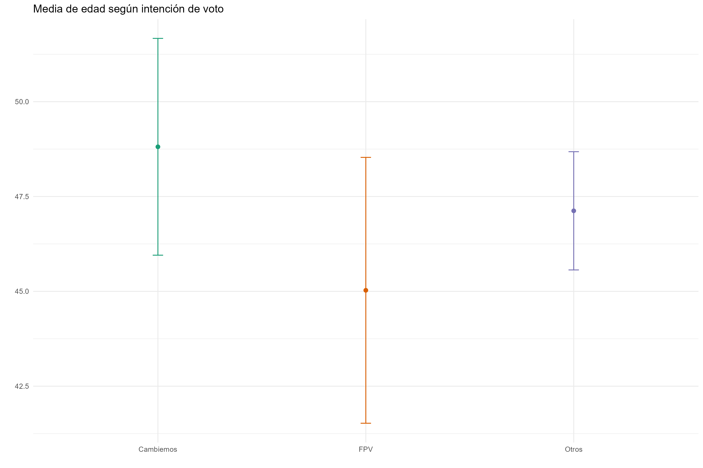

class: inverse, center, middle

```{r setup, include=FALSE}
library(xaringanthemer)
library(kableExtra)
library(xaringan)
library(tidyverse)
library(data.table)
library(gapminder)
library(xaringanExtra)

style_duo_accent(primary_color = "#035AA6",
                 secondary_color = "#507786",
                 text_font_family = "Droid Serif",
                 text_font_url = "https://fonts.googleapis.com/css?family=Droid+Serif:400,700,400italic",
                 header_font_google = google_font("Yanone Kaffeesatz"),
                 text_slide_number_color = "#000000")
knitr::opts_chunk$set(echo = FALSE)
options("kableExtra.html.bsTable" = T)

htmltools::tagList(
  xaringanExtra::use_clipboard(
    button_text = "<i class=\"fa fa-clipboard\"></i>",
    success_text = "<i class=\"fa fa-check\" style=\"color: #90BE6D\"></i>",
    error_text = "<i class=\"fa fa-times-circle\" style=\"color: #F94144\"></i>"
  ),
  rmarkdown::html_dependency_font_awesome()
)
xaringanExtra::use_xaringan_extra(c("tile_view", "animate_css", "tachyons"))
xaringanExtra::use_scribble()
use_extra_styles(
  hover_code_line = TRUE,         
  mute_unhighlighted_code = TRUE
  )  
```

# Importar datos y etiquetas

---

## Encuestas con R

Trabajar con encuestas en R puede ser complicado sin las herramientas adecuadas. Varios paquetes nos ayudan a manejar estos datos. El primero que vamos a utilizar es haven es que importamos datos desde softwares en los que normalmente se procesan encuestas (SPSS o Stata, por ejemplo).

Trabajaremos con una base parcial de la encuesta de Latinobarómetro en Argentina en 2007. La base original está en SPSS y muchas de sus variables tienen etiquetas.

.codefont[
```{r ch1, echo = TRUE}
library(haven)

lat_17 <- read_spss("data/Lat_17.sav") 

glimpse(lat_17)
```
]

---

## Etiquetas

Cuando importamos data de SPSS o Stata con variables categóricas que tienen etiquetas (ej: 1 = Aprueba; 2 = Desaprueba) con el paquete haven, por defecto el valor de las variables será el numérico (son de tipo dbl) y tendrán las etiquetas como atributos. En general, al trabajar en R es mejor transformar estas variables categóricas en factores. Para ello podemos usar la función `as_factor()` (no confundir con `as.factor()`)

.codefont[
```{r ch2, echo = TRUE}
lat_17 <- read_spss("data/Lat_17.sav") %>% 
    as_factor() # Etiquetas como valores

glimpse(lat_17)
```
]

---

## Etiquetas

.codefontchico[
```{r ch4, echo = TRUE}
# Exploremos la variable voto
table(lat_17$P16STGBS) 
```
]

---

## Etiquetas

Si bien la data es solo de Argentina, originalmente estaban todos los países por lo que los valores de los factores corresponden a todas las etiquetas posibles por más que no haya casos en la mayoría

.codefontchico[
```{r ch5, echo = TRUE}
# Demasiados factores, pasemos a character
table(as.character(lat_17$P16STGBS))
```
]

---

## Etiquetas

Un poco de manipulación de datos:

.codefont[
```{r ch6, echo = TRUE}
# Primero nos aseguramos de que el ponderador sea numérico
# Renombremos la variable de intención de voto, transformemosla en caracteres 
# para quitarle los niveles vacíos y creemos una variable resumen con PRO/UCR, 
# FPV y otros
lat_17 <- lat_17 %>% 
  mutate(wt = as.numeric(wt)) %>% 
  mutate(int_voto = as.character(P16STGBS)) %>% 
  mutate(int_voto_res = case_when(
    str_detect(int_voto, "FPV") ~ "FPV",
    str_detect(int_voto, "PRO") ~ "Cambiemos",
    str_detect(int_voto, "UCR") ~ "Cambiemos",
    TRUE ~ "Otros"
  ))

```
]

---

## Etiquetas

Chequeo que haya quedado bien

.codefont[
```{r ch7, echo = TRUE}
table(lat_17$int_voto, lat_17$int_voto_res)
```
]

---
class: inverse, center, middle

# Tablas ponderadas

---

## Tablas ponderadas

Con dplyr podemos crear tablas o resumenes ponderados usando la función `sum()` y la variable de ponderación como argumento.

.pull-left[
.codefont[
```{r ch8, echo = TRUE}
# Simple
lat_17 %>% 
  group_by(int_voto_res) %>% 
  summarise(frec = n())
```
]]

.pull-right[
.codefont[
```{r ch8b, echo = TRUE}
# Ponderada
lat_17 %>% 
  group_by(int_voto_res) %>% 
  summarise(frec_pond = sum(wt)) 
```
]]

---
## Tablas ponderadas

Si agregamos una línea con `mutate()` ya podemos obtener los porcentajes

.codefont[
```{r ch9, echo = TRUE}
# Con proporción
lat_17 %>% 
  group_by(int_voto_res) %>% # Variables de agrupar
  summarise(frec_pond = sum(wt)) %>%  # Resumir frecuencias (ponderadas)
  mutate(per = frec_pond / sum(frec_pond)) # Agregar columna de porcentaje
```
]

---
## Tablas ponderadas

También podemos crear una tabla cruzada

```{r ch10, echo = TRUE, message=FALSE}
# Dos variables porcentaje por factor: sexo según voto
s_vot <- lat_17 %>% 
  group_by(int_voto_res, sexo) %>% 
  summarise(frec_pond = sum(wt)) %>%
  mutate(per = frec_pond / sum(frec_pond)) 
s_vot
```

---
## Tablas ponderadas

Grafico simple:

.codefont[
```{r ch11, echo = TRUE, eval = FALSE}
ggplot(s_vot, aes(x = int_voto_res, y = per, fill = sexo)) +
  geom_col(alpha = .8) +
  theme_bw() +
  scale_fill_brewer(palette = "Dark2") +
  theme(legend.position = "bottom") +
  labs(title = "Distribución de género según intención de voto",
       x = "", y = "")
```
]
.center[
```{r, out.width = "500px"}

```
]

---
class: inverse, center, middle

# Crear ponderadores

---
## Ponderación (raking)

El paquete [anesrake](https://www.rdocumentation.org/packages/anesrake/versions/0.80/topics/anesrake) permite crear ponderadores con el método de raking. Supongamos que queremos crear un nuevo ponderador para sexo y edad.

```{r ch12, echo = TRUE, message=FALSE, warning=FALSE}
library(anesrake)

# Supongamos que quiero ponderar por sexo y el parámetro es 
# 60% mujeres y  40% hombres 

prop.table(table(lat_17$sexo)) # Hay diferencia importante

# Creo vector con parametro y nombro los valores
# Tienen que coincidir con los valores de la variable
par_sexo <- c(0.6, 0.4) # Es un ejemplo, no son reales
names(par_sexo) <- c("Female", "Male")
par_sexo
```

---

## Ponderación (raking)

Recodifico variable para ajustar al formato del parámetro poblacional:

```{r ch13, echo = TRUE}
# Lo mismo con edad en 3 categorías
lat_17 <- lat_17 %>% 
  mutate(edad_rec = case_when(
    edad <= 39 ~ "18 a 39",
    edad >= 40 & edad <=59 ~ "40 a 59",
    edad >= 60 ~ "60 o mas"
  ))

prop.table(table(lat_17$edad_rec))

# Creo vector con parámetro (inventado) también:
par_edad <- c(0.3, 0.4, 0.3)
names(par_edad) <- c("18 a 39", "40 a 59", "60 o mas")

```


---

## Ponderación (raking)

Algunos paso previos: crear id para encuestados, chequear que las variables sean factores y que la data sea formato `data.frame` no `tibble`

.codefontchico[
```{r ch14, echo = TRUE}
lat_17 <- mutate(lat_17, id = row_number()) # Crear id

is.factor(lat_17$sexo) # Chequeo que mis variables sean factores
is.factor(lat_17$edad_rec) 

lat_17 <- mutate(lat_17, edad_rec = as.factor(edad_rec)) # Transformo edad a factor
is.factor(lat_17$edad_rec) 

# IMPORTANTE: La data tiene que estar en formato dataframe no tibble! 
class(lat_17)
lat_17 <- as.data.frame(lat_17)
class(lat_17)
```
]

---

## Ponderación (raking)

Ahora ya estamos prontos para ponderar:

```{r ch15, echo = TRUE}
parametros <- list(par_sexo, par_edad) # Lista con todos los parametros
names(parametros) <- c("sexo", "edad_rec") # Nombrar con el nombre exacto de las variables

## Ponderador 
outsave <- anesrake(
  parametros, # Lista con parámetros 
  lat_17, # Data 
  caseid = lat_17$id, # Id único por caso
  cap = 5, # Fijo peso máximo de 5
  type = "nolim",
  pctlim = 5, # Si la diferencia no es > a 5% no tenga en cuenta la var
  force1 = TRUE # Asegura que cada parametro sume 1 si hay pequeñas diferencias
  )
```

---

## Ponderación (raking)
.codefontchico[
```{r ch15_b, echo = TRUE}
summary(outsave) # Resumen
```
]

---

## Ponderación (raking)

Pego el ponderador como columna del df

.codefont[
```{r sdasch15_b, echo = TRUE}
lat_17 <- mutate(lat_17, ponderador = unlist(outsave[1]))
glimpse(lat_17)
```

---

## Ponderación (raking)

Chequeo que haya funcionado:

.codefont[
```{r ch17, echo = TRUE}
lat_17 %>% 
  group_by(sexo) %>% 
  summarise(sexo = sum(ponderador)) %>% 
  mutate(sexo = sexo / sum(sexo))
            
lat_17 %>% 
  group_by(edad_rec) %>% 
  summarise(edad_rec = sum(ponderador)) %>% 
  mutate(edad_rec = edad_rec / sum(edad_rec))
```
]

---

## Ponderación (raking)

Comparar intención de voto según ponderación (sin ponderar, ponderador original y ponderador con parámetros falsos como ejemplo)

```{r ch16, echo = TRUE}
lat_17 %>% 
  group_by(int_voto_res) %>% 
  summarise(cruda = n(),
            wt = sum(wt),
            pond = sum(ponderador)) %>% 
  mutate(cruda = cruda / sum(cruda),
         wt = wt / sum(wt),
         pond = pond / sum(pond))  
```


---
class: inverse, center, middle

# survey y srvyr

---
## Paquete survey

El paquete [survey](https://cran.r-project.org/web/packages/survey/survey.pdf) y [srvyr](https://cran.r-project.org/web/packages/srvyr/vignettes/srvyr-vs-survey.html) su versión con sintaxis similar a dplyr son muy útiles cuando queremos analizar datos de encuestas, permitiendo hacer cálculos teniendo en cuenta diseños complejos.

Con la función `svydesign()` se especifican los ponderadores (de diseño y post-estratificación) y los estratos, luego cuentan con varias funciones que calculan estadísticas descriptivas e inferenciales teniendo en cuenta el diseño de la encuesta ver [survey tutorial](https://stats.idre.ucla.edu/r/seminars/survey-data-analysis-with-r/) y [srvyr tutorial](https://cran.r-project.org/web/packages/srvyr/vignettes/srvyr-vs-survey.html)


---
## Declarar data como encuesta

Primero declaramos dataframe como objeto de encuesta (especificando solo ponderador en este caso).

```{r ch18, echo = TRUE, message=FALSE}
library(srvyr)

# Declarar como survey object con ponderador
svy <- lat_17 %>% 
  as_survey_design(weight = wt)

svy
```


---

## Manipulación de objeto tipo survey

El paquete srvyr sigue la lógica del tidyverse, y a sus objetos se le pueden aplicar funciones del dplyr como `mutate()` o `rename()`

.codefont[
```{r ch19, echo = TRUE}
svy <- svy %>% 
  rename(pais = idenpa)  

svy
```
]

---

## Variable numéricas

Podemos usar funciones de srvyr como `survey_mean()` o `survey_total()` dentro de `summarize()` como en dplyr:

.codefont[
```{r echo = TRUE}
# Media, desvío estandar e intervalo de confianza
svy %>%
  srvyr::summarize(media_edad = survey_mean(edad, vartype = c("se", "ci")))

# Cuantiles
svy %>%
  srvyr::summarize(edad_quantil = survey_quantile(edad, c(0.25, 0.5, 0.75)))

```
]

---

## Variable numéricas

Podemos estimar estas métricas por grupo:

.codefont[
```{r echo = TRUE}
svy %>%
  group_by(int_voto_res) %>%
  srvyr::summarize(id_mean = survey_mean(edad, vartype = c("se", "ci")))
```
]

---

## Variable numéricas

Graficamos con ggplot:

.center[
```{r, out.width = "500px"}

```
]

---

## Variable categóricas

Porcentaje, n ponderado y ni sin ponderar

.codefont[
```{r echo = TRUE}
svy %>%
  group_by(int_voto_res) %>%
  srvyr::summarize(porcentaje = survey_mean(),
                   n_pond = survey_total(),
                   n_no_pond = unweighted(n()))
```
]

---

## Variable categóricas

Porcentaje sobre primer categoría (sexo)

.codefont[
```{r echo = TRUE}
svy %>%
  group_by(sexo, int_voto_res) %>%
  srvyr::summarize(porcentaje = survey_mean(vartype = "ci"))
```
]


---

## Variable categóricas

Graficamos con ggplot:

.center[
```{r, out.width = "500px"}

```
]


---

## Estadística inferencial

Para estimar modelos de regresión y otras técnicas de estadística inferencial debemos usar el paquete survey, que funciona con la sintaxis de fórmula:

.codefont[
```{r echo = TRUE}
# Regresión logística
svy <- svy %>% 
  mutate(vot_camb = case_when(
    int_voto_res == "Cambiemos" ~ 1,
    TRUE ~ 0
  ))

logit1 <- survey::svyglm(vot_camb ~ sexo + edad, family = quasibinomial, 
                         design = svy, na.action = na.omit)
summary(logit1)
```
]


