class: inverse, center, middle

```{r setup, include=FALSE}
library(xaringanthemer)
library(kableExtra)
library(xaringan)
library(xaringanExtra)

style_duo_accent(primary_color = "#035AA6",
                 secondary_color = "#507786",
                 text_font_family = "Droid Serif",
                 text_font_url = "https://fonts.googleapis.com/css?family=Droid+Serif:400,700,400italic",
                 header_font_google = google_font("Yanone Kaffeesatz"),
                 text_slide_number_color = "#000000")
knitr::opts_chunk$set(echo = FALSE)
options("kableExtra.html.bsTable" = T)

htmltools::tagList(
  xaringanExtra::use_clipboard(
    button_text = "<i class=\"fa fa-clipboard\"></i>",
    success_text = "<i class=\"fa fa-check\" style=\"color: #90BE6D\"></i>",
    error_text = "<i class=\"fa fa-times-circle\" style=\"color: #F94144\"></i>"
  ),
  rmarkdown::html_dependency_font_awesome()
)
use_xaringan_extra(c("tile_view", "animate_css", "tachyons"))
use_scribble()
use_extra_styles(
  hover_code_line = TRUE,         
  mute_unhighlighted_code = TRUE
  )  
```


# ¿Qué es y qué se puede hacer con R?  

---

## R y R Studio

.pull-left[

- R es un software y un lenguaje de programación gratuito enfocado en el análisis estadístico y la visualización de datos.

- R cuenta con gran potencia y flexibilidad, así como una númerosa -y creciente- comunidad de usuarios tanto académicos como profesionales.

.center[
```{r, out.width = "150px"}
knitr::include_graphics("ima/Rlogo.png")
```
]]

.pull-right[
- R Studio es un entorno de desarrollo integrado (IDE) . O en otras palabras... es una interfaz un poco (bastante) más amigable que usar R directamente.

.center[
```{r, out.width = "200px"}

```
]]

---

## ¿Por qué usar R? 

- Es un software libre y gratuito
--

- Generar nuevas funciones es fácil, por lo que las está en constante desarrollo
--

- Tiene muchos usuarios de diversas disciplinas lo que genera una comunidad (particularmente mediante foros) que es de gran utilidad para la resolución de problemas de código
--

- Es uno de los programas más utilizados para técnicas innovadaras en estadística y visualización de datos 
--

- Trabaja muy bien con otros programas/lenguajes (Excel, Latex, HTML, etc.)
--

- Es cada vez más usado tanto en el ámbito académico como profesional
--

---
class: inverse, center, middle

# ¿Qué se puede hacer con R? 

---

## ¿Qué se puede hacer con R?

- Ingresar datos
--

- Importar y exportar datos (de Excel, Stata, documento de texto, APIs, etc)
--

- Manipular datos (recodificación, cambios de estructura)
--

- Estadística descrpitiva e inferencial
--

- Visualización de datos (gráficos de alta calidad)
--

- Técnicas estadísticas y de visualización de datos innovadoras
--

- Crear tus propias funciones y paquetes
--

- Escribir artículos y presentaciones integrando código
--

- Escribir libros
--

- Webscrapping, trabajar con Big data y machine learning
--

- Aplicaciones intercativas para visualización de datos (shiny apps)
--

- Hasta jugar videojuegos!

---

## Algunos ejemplos: visualización de datos
.center[
```{r, out.width = "750px"}
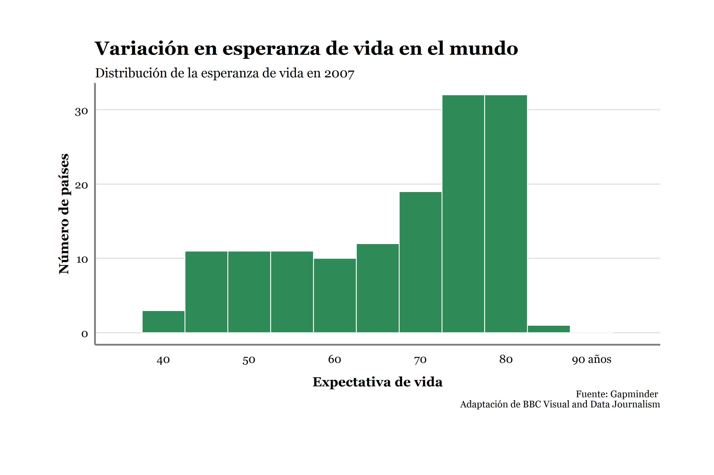
```
]
---

## Algunos ejemplos: visualización de datos
.center[
```{r, out.width = "750px"}
knitr::include_graphics("ima/ima10.png")
```
]
---

## Algunos ejemplos: visualización de datos
.center[
```{r, out.width = "750px"}
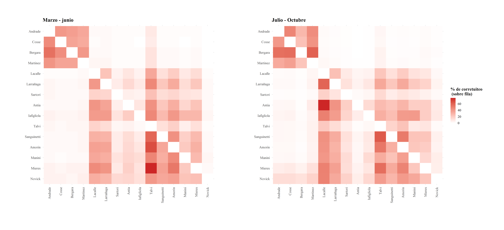
```
]
---

## Algunos ejemplos: visualización de datos
.center[
```{r, out.width = "450px"}
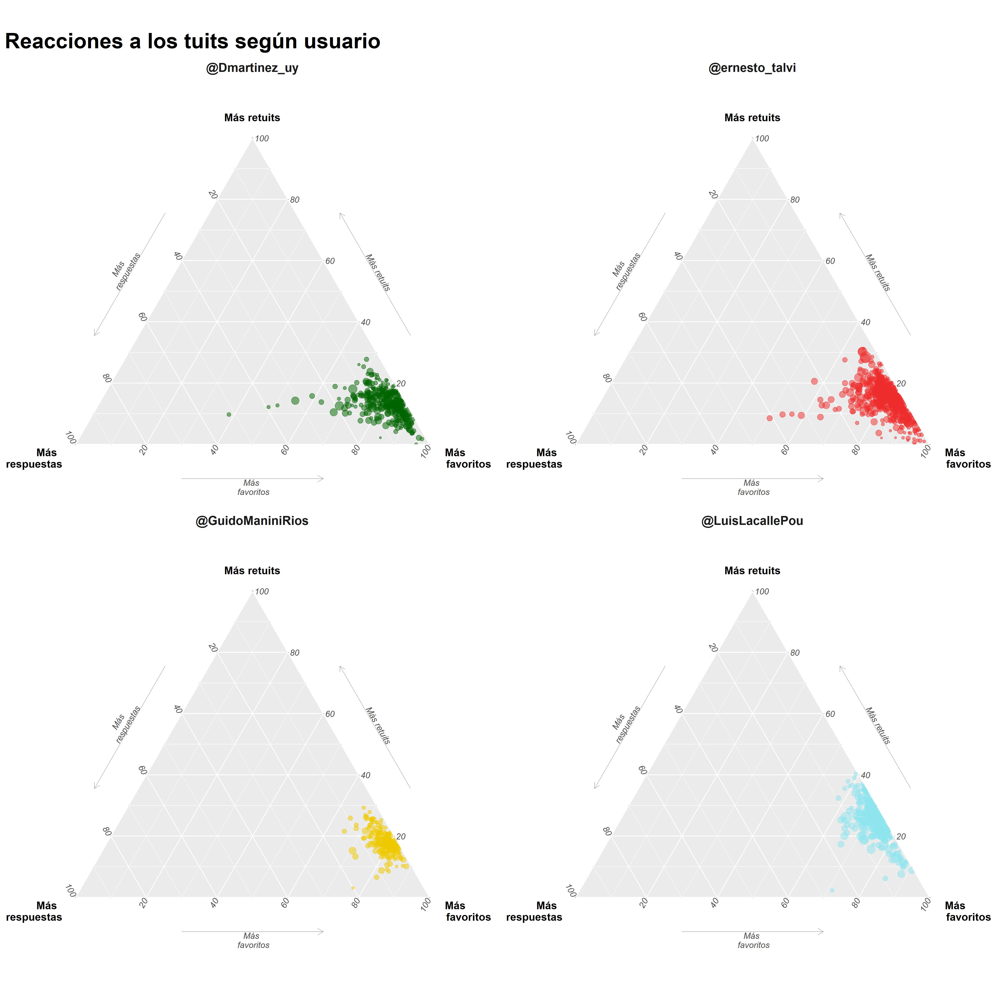
```
]
---

## Algunos ejemplos: visualización de datos
.center[
```{r, out.width = "600px"}
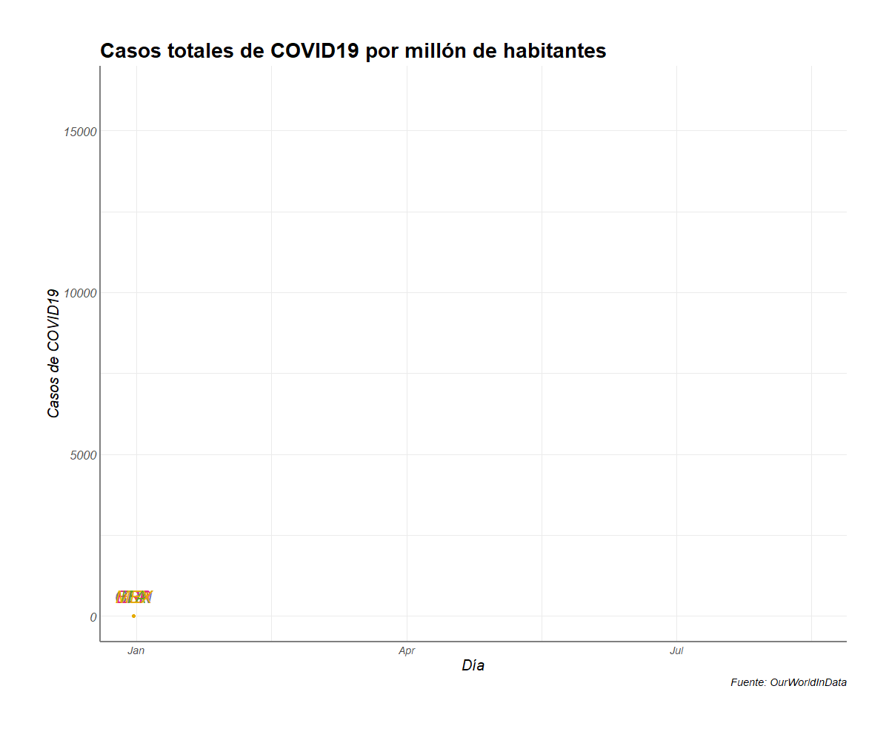
```
]
---

## Algunos ejemplos: visualización de datos
.center[
```{r, out.width = "650px"}
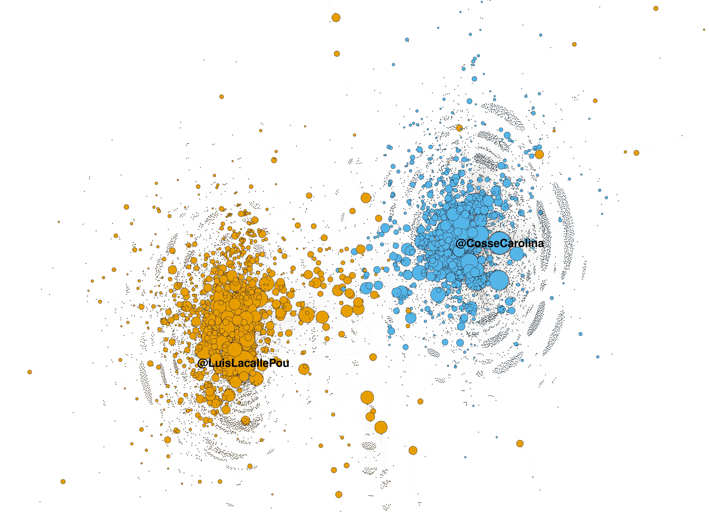
```
]
---

## Algunos ejemplos: Webscrapping (APIs) 
```{r tw, echo = FALSE, results='hide', message=FALSE, warning=FALSE}
library("rtweet")
library("dplyr")
library("kableExtra")
twitter_token <- create_token(
  app = "Uruguayan electoral cicle2019",
  consumer_key = "jiDmeaYrTvkIiLdxuXAZMXTeX",
  consumer_secret = "TRUEGYuDvmQbiDRtCCORcXUcgY0Ziv5iUIQ60pyYyqAVG7A43W",
  access_token = "1055812931986903041-KZ2EqHk1JBcbun2EPADj6Gpu7FMAGl",
  access_secret = "wD6nLV39SMtbcf5LcUvABQTNwLxTW318CJMg0HDXYryN4", set_renv = FALSE)
```

.codefontchico[
```{r tw2, echo = TRUE}
tweets_eim <- get_timeline("EscuelaMetodos", n = 2, token=twitter_token)
tweets_eim <- select(tweets_eim, text, retweet_count, favorite_count)
```
]

```{r tw2b, echo = FALSE}
tweets_eim$text <- gsub("[^\x01-\x7F]", "", tweets_eim$text)
knitr::kable(tweets_eim, format = 'html', font_size = 7) %>% 
    kable_styling(full_width = F)
```

```{r ej9bbb, echo = FALSE, results="hide"}
rm(tweets_eim,twitter_token)
```

---

## Aplicaciones (shiny apps), paquetes y presentaciones

- [Mirador DESCA](https://bancodedatos-fcs.shinyapps.io/Mirador-DESCA-app/) 

- [OPUY](https://github.com/Nicolas-Schmidt/opuy) 

- Esta misma presentación, ver [Xaringan](https://github.com/yihui/xaringan)

- [r4ds](https://r4ds.had.co.nz/)

---
class: inverse, center, middle

# Aprendizaje

---

## ¿Qué tan difícil es aprender R?

- Al comienzo puede ser más difícil que la sintaxis básica de otros programas, particularmente porque es un lenguaje bastante distinto al resto. Sin embargo, una vez que se logra cierto entendimiento y autonomía, las posibilidades son infinitas.

- Muchas de las dificultades para aprender R se deben a sus principales ventajas: flexibilidad y potencia.

---

## Recursos 

Ningún recurso es en si mismo suficiente para aprender R. Cada análisis de datos es particular en su manera y las soluciones no siempre estarán en el contenido de un curso o libro específico. Hay muchos recursos para aprender R de forma general y para obtener ayuda puntual.

.center[
```{r image_grobs, fig.show = "hold", out.width = "25%", fig.align = "default"}

knitr::include_graphics("ima/sof.png")


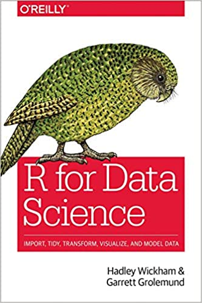

```
]
---

## Recursos
La comunidad de usuarios de R es inmensa y muy abierta. Por esto hay muchísimos recursos para aprender de forma independiente y resolver problemas cuando nos estancamos:

- Libro "R for Data Science". Es muy completo y referencia en la mayoría de los cursos de R, pueden acceder a la versión online [original](https://r4ds.had.co.nz/) y a una [traducción](https://r4ds-en-espaniol.netlify.app/)
- [Hands On Programming with R](https://rstudio-education.github.io/hopr/basics.html) es otro libro libre muy útil sobre R  
- [R Bloggers](https://www.r-bloggers.com/) y [rpubs](https://rpubs.com/) publican miles de tutoriales para temas específicos 
- Existen foros -por ej. [Stack Overflow](https://stackoverflow.com/)- donde responden una infinidad preguntas de programación en R. 
- [IntRo](https://github.com/Nicolas-Schmidt/IntRo) es un excelente curso de R (con gran contenido teórico) de FCS-UdelaR a cargo de Nicolás Schmidt 
- [AnalizaR](https://arcruz0.github.io/libroadp/index.html) es un libro sobre análisis de datos en R con énfasis en Ciencia Política 

---

## Ayuda  

.center[
```{r, out.width = "500px"}
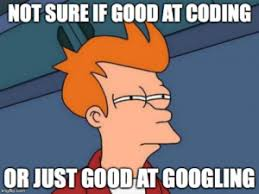
```
]

---

## Ayuda  

- Obtener la ayuda correcta es fundamental al programar en R. Podemos obtener ayuda de todas las funciones que utilizamos con el comando `help()` (ej. `help(mean)`) o `?` (ej. `?mean`)

- Si no podemos solucionar un error con la documentación de las funciones/paquetes muchas veces sirve buscar en un navegador 

- Muchas páginas contienen información relevante para solucionar problemas, entre las que se destaca [stackoverflow](https://stackoverflow.com/questions/tagged/r)

- En caso de no encontrar solución se puede consultar en páginas como stackoverflow mediante un [ejemplo reproducible o reprex](https://stackoverflow.com/questions/5963269/how-to-make-a-great-r-reproducible-example)

---

## Ayuda

```{r ej9bb2_e3, echo = TRUE, eval = FALSE}
help(mean)
```

.center[
```{r, out.width = "1000px"}
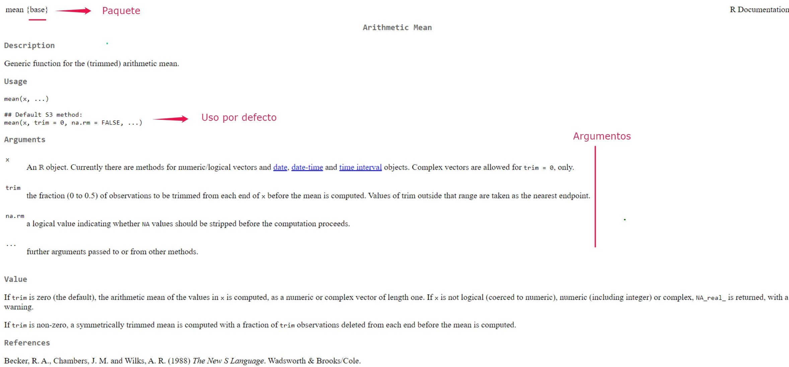
```
]

---
class: inverse, center, middle

# Estructura y objetivos del curso 

---

## Sesiones 

- .bold[Día 1: Introducción y fundamentos de la programación en R:]
    -  Ventajas de R y distintas aplicaciones
    -  Interfaz, obtener ayuda
    -  Operadores, objetos, funciones y paquetes
    -  Funciones básicas
    
- .bold[Día 2: Estadística descriptiva y limpieza de datos]
    -  Marcos de datos (dataframes)
    -  Estadísticos descriptivos
    -  Importar y exportar datos desde otros formatos (excel, Stata, etc.)
    -  Recodificación de variables y tablas descriptivas

---

## Sesiones 

- .bold[Día 3: Manipulación de datos]
    -  Manipulación de datos con tidyverse (ordenar, agrupar, filtrar, resumir, etc.)
    -  Integración de bases de datos
    -  Cambios de estructura de base de datos
    
- .bold[Día 4: Visualización de datos y estadística inferencial]
    -  Análisis exploratorios con gráficos
    -  Tipos de gráficos y atributos (paletas de colores, anotaciones, etc.)
    -  Gráficos animados
    -  Estimar, ordenar y visualizar modelos de regresión

---

## Documentos para cada sesión


Cada sesión tendrá los siguientes documentos:
- Presentación 

- Script ejemplo con el código de lo presentado

- Ejercicios sobre lo aprendido en clase

- Script con una solución para el ejercicio

Todos los materiales de curso están colgados en la [webasignatura](https://webasignatura.ucu.edu.uy/login/index.php) y en la página web del curso: [https://martinopertti.github.io/IntroR-web/](https://martinopertti.github.io/IntroR-web/)

---

## Objetivo

 El objetivo de este curso es que los estudiantes adquieran las herramientas básicas para comprender y escribir código en R para el análisis de datos. El curso provee los cimientos para que los estudiantes logren autonomía y eficiencia en el uso de R. 
 
 
---
class: inverse, center, middle

# Primeros pasos

---

## Abrimos R Studio 
.center[
```{r, out.width = "1000px"}
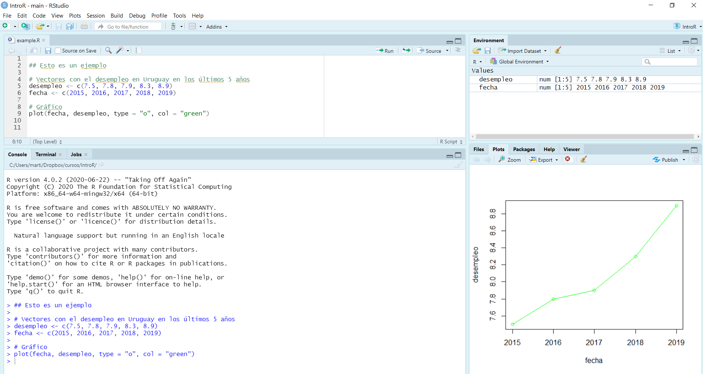
```
]
---

## Personalizar R Studio (opcional)
.center[
```{r, out.width = "1000px"}
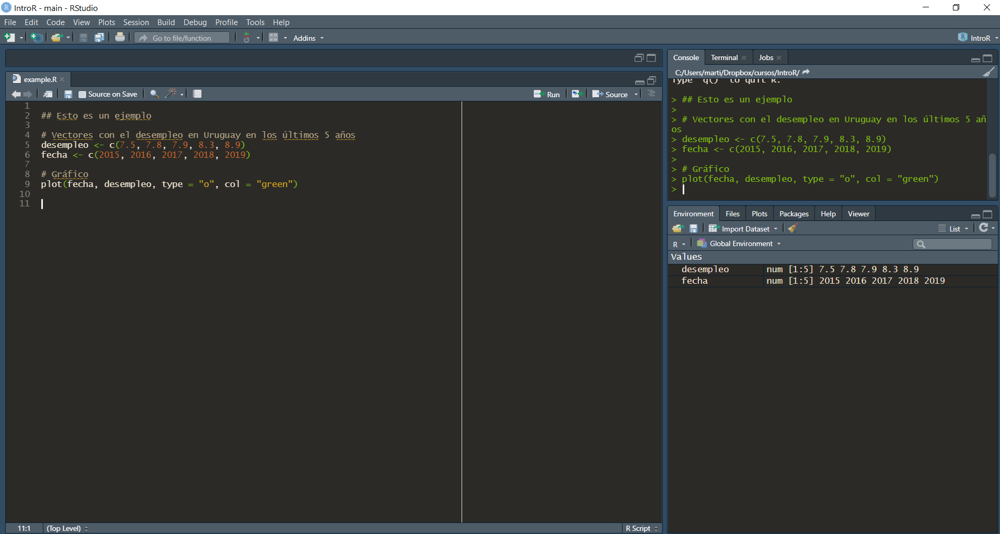
```
]

---

## R Studio

- .bold[Source (editor):] es donde creamos y editamos los scripts, es decir, donde escribimos y almacenamos el código.

- .bold[Console (consola):] imprime el código que corremos y la mayoría de los resultados. Podemos escribir código directamente aquí  también, aunque si queremos guardarlo lo recomendable es hacerlo en el script.

- .bold[Environment (ambiente):] Muestra todos los objetos que creaste en cada sesión.

- .bold[Gráficos (y más):] Imprime los gráficos. En el mismo panel figuran otras pestañas como "Help" que sirve para buscar ayuda.

---

## Scripts 

- Es un archivo de texto con el código y anotaciones. 

- Se crea arriba a la izquierda "file/New File/R Script" o `ctrl + shift + n`. 

- Se guarda con `ctrl + s` y es un documento de texto como cualquier otro (word, txt). Esto nos permite reproducir paso a paso todo lo que hicimos durante nuestro análisis.

- Haciendo click luego en el script guardado se inicia R Studio. 

- Para ejecutar una línea de código pueden usar el botón de "Run" arriba a la derecha o -más cómodo- `ctrl + enter`
     
---

## Workspace
- R nos ofrece guardar el ambiente (objetos, funciones, datos, etc.) luego de terminada cada sesión (lo que llama workspace). Si lo guardamos, la próxima vez que abramos ese script, nos encontraremos todo como lo dejamos (existirán los mismos objetos, funciones y datos). 

- Lo recomendado es NO guardar el workspace, y guardar solamente el Script. De esta forma, cuando retomemos nuestro análisis en una nueva sesión de R, podemos correrlo y chequear que efectivamente genere los que querramos.

- Pueden desactivar la pregunta en Tools - Global Options - General - desmarcando la opción "Save workspace into RData" y desmarcando "restore RData into workspace"
      
---
class: inverse, center, middle

# Lenguaje básico de R

---

## Anotaciones

- Es importante ser prolijo y cuidadoso con lo que hacemos
- Los scripts nos dan la posibilidad de anotar comentarios, lo que es muy útil:

```{r ej3, echo = TRUE}
## Esta línea es una anotación. 

## R ignora todo lo que está acá adentro (tiene que empezar con #)

## Podemos escribir nombres de funciones u objetos y R no las va a
# interpetar

## Usar anotaciones es clave para poder entender qué fue lo que
# hicimos anteriormente
```

- De esta forma, podemos comentar que fue lo que hicimos para acordarnos nosotros, y que los demás entiendan

---

## R como calculadora 

Para empezar, R sirve como calculadora. Se pueden realizar operaciones matemáticas, por ejemplo:

.codefont[
```{r ej5x, echo = TRUE}
# Operaciones sencillas
2 + 2  
20 - 10
10 / 2
10 * 10
```
]

---

## Objetos en R
En muchos programas estadísticos solemos solamente "imprimir" resultados (lo que llamamos expresiones). En R podemos utilizar este enfoque:

```{r ej5, echo = TRUE}
# Una operación sencilla:
43*47 # Se imprime el resultado
```

Sin embargo, en R también podemos almacenar los resultados en objetos. Creamos los objetos mediante asignaciones (`<-`). En este caso, guardemos el valor (a diferencia de imprimirlo). 

```{r ej5b, echo = TRUE}
year <- 43*47 # Se crea un objeto
```

Si a esto lo ponemos entre paréntesis combinamos ambos enfoques: se guarda el objeto y se imprime el resultado

```{r ej5z, echo = TRUE}
(year <- 43*47) # Se crea un objeto y se imprime
```
---

## Asignaciones 

- El símbolo para crear un objeto es ` <-` (alt + -) y se llama asignador, también se puede usar `=` pero no es recomendable.
- Las asignaciones se crean de la siguiente manera: nombre_del_objeto `<-` valor.  
- Como vimos, una vez que creo un objeto, R (por defecto) no imprime su valor. Este se puede obtener escribiendo simplemente el nombre del objeto o mediante la función `print()`:

.codefont[
```{r ej5c, echo = TRUE}
year <- 43*47 # Se crea un objeto

year # Imprime el objeto year

print(year) # Imprime el objeto year
```
]

---

## Algunos comandos básicos
```{r ej5c2, echo = TRUE, eval = FALSE}
ls() # Lista los objetos en el ambiente

rm(year) # Borra objeto del ambiente

rm(list=ls()) # Borra todos los objetos del ambiente

help(ls) # Buscar ayuda sobre una función
```

---
class: inverse, center, middle

# Objetos 

---

## Clases y tipos de objetos

- En R utilizamos constantemente objetos. Cada objeto tiene una clase, tipo y atributos. 

- Esto es importante porque las funciones que podemos aplicar a nuestros datos dependen del objeto en el que los definimos.

- El uso de objetos tiene muchos benificios como extraer parte de ellos para determinados usos, duplicarlos o realizar operaciones sin imprimir en la consola.

---

## Tipos de objetos

El tipo de un objeto refiere a cuál es el tipo de los datos dentro del objeto. Los tipos más comunes son:
 
```{r t1, echo = FALSE, results="hide"}
Nombre <- c("integer", "double", "character", "logical")
Tipos <- c("Númerico: valores enteros", "Númerico: valores reales", "Texto", "Lógico (TRUE or FALSE)")
Ejemplo <- c(10, 10.5, "Diez", TRUE)
tabla1 <- data.frame(cbind(Nombre, Tipos, Ejemplo))
```
 
```{r t1_c, echo = FALSE}
tabla1 %>%
  kbl() %>%
  kable_styling(bootstrap_options = c("striped", "hover", "condensed"), font_size = 20)
```

---

## Clases o estructura de datos

Las clases de objetos son formas de representar datos para usarlos de forma eficiente. Se dividen en cuántas dimensiones tienen y si poseen distintos tipos de datos o no. Las clases de datos más comunes en R son: 

- `vector` (vectores): es la forma más simple, son unidimensionales y de un solo tipo

- `lists` (listas): son unidimensionales pero no están restringidas a un solo tipo de datos

- `matrix` (matrices): tienen dos dimensiones (filas y columnas) y un solo tipo de datos. 

- `dataframes` (marcos de datos): son el tipo de estructura al que más acostumbrado estamos, con dos dimensiones (filas y columnas) y puede incluir distintos tipos de datos (uno por columna). Pueden considerarse como listas de vectores con el mismo tamaño. 


En ocasiones podemos transformar objetos de una clase a otra.


---
## Clases y tipos de objetos

.center[
```{r ej5434, out.width = "800px"}
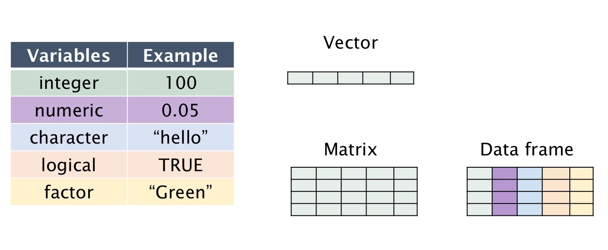
```
]

.right[ R variables and data types: Introduction to R Programming, Sydney-Informatics
]


---

## Funciones para explorar objetos

R tiene funciones que nos permiten identificar la clase, el tipo, la estructura y los atributos de un objeto.

- `class()` - ¿Qué tipo de objeto es?

- `typeof()` - ¿Qué tipos de data tiene el objeto?

- `length()` - ¿Cuál es su tamaño?

- `attributes()` - ¿Tiene metadatos?

---

## Clases y tipos de objetos

```{r ej7, echo = TRUE}
  # Creamos algunos objetos distintos
  year <- 2021
  nombre <- "Dos mil veintiuno"
  
  # Uso la función class para averiguar la clase de objeto
  class(year) 
  class(nombre)
  
  # Uso la función typeof para averiguar el tipo de la data del objeto
  typeof(nombre)
  
```

---

## Clases y tipos de objetos

Todo lo que escribimos entre comillas se interpeta como texto, por más que sean números. 

```{r ej7_b, echo = TRUE}
  year_2 <- "2021"

  class(year_2)
  
  vof <- TRUE
  class(vof) 
```
  
---

## ¿Por qué importan los tipos y clases? 
Supongamos que creamos un objeto con el valor 10, al que luego le sumaremos otro objeto con el valor 20. 

```{r ej7b2, echo = TRUE, error=TRUE}
obj_1 <- "10"

class(obj_1)
obj_1 + 20 # Da error
```

---

## ¿Por qué importan los tipos y clases? 
En cambio, si creamos el objeto de tipo númerico:

```{r ej7b3, echo = TRUE}
obj_1 <- 10

class(obj_1)
obj_1 + 20 # Funciona
```

---

## ¿Por qué importan los tipos y clases? 
Normalmente no trabajamos con objetos de un solo valor, y reescribirlos no es una opción. Para ellos tenemos coercionadores `as.logical()`, `as.integer()`, `as.double()`, o `as.character()`: funciones que transforman un objeto de un tipo a otro. En este caso:
```{r ej7b32, echo = TRUE, error=TRUE}
obj_1 <- "10"

class(obj_1)

obj_1 <- as.numeric(obj_1)
class(obj_1)
is.numeric(obj_1) # Podemos verificarlo directamente también
```

---
class: inverse, center, middle

# Vectores

---

## Vectores 
Un vector es una colección de elementos. Los vectores atómicos son los que contienen elementos todos del mismo tipo (que es lo más normal en el análisis de datos). Hay 4 tipos de vectores: lógicos, character, integer y double (estos dos últimos son numéricos). Los elementos determinarán el tipo del objeto. Crear un vector es muy sencillo mediante la función `c()`:

.codefont[
```{r ej7b35a, echo = TRUE}
mi_primer_vector <- c(1, 3, 5, 7, 143) 
print(mi_primer_vector)
class(mi_primer_vector)
length(mi_primer_vector)
str(mi_primer_vector)
```
]

---

## Vectores 

.codefontchico[
```{r ej7b35, echo = TRUE}
v1 <- c(1:5) # Todos los números de 1 a 5
v1
v2 <- seq(0, 50, 10) # De 0 a 50 de a 10 números
v2
v3 <- c(v1, v2) # Combino vectores creando un nuevo vector
v3
v4 <- c("rojo", "verde", "blanco") # character
v4
v5 <- c(TRUE, TRUE, FALSE, TRUE) # lógico
v5
```
]

---

## Indexación 
Cuando queremos referirnos a uno o varios elementos dentro de un vector utilizamos `[]` (indexación).
```{r ej7b35b, echo = TRUE}
## Indexación:
v2
v2[1] # El primer elemento dentro del vector 
# Nos sirve por ejemplo para extraer partes del vector:
v3 <- v2[1:3] # Creo nuevo vector con los elementos del 1 al 3
v3
```

---

## Operaciones con vectores

También podemos realizar operaciones con los vectores númericos:
```{r ej7b35c, echo = TRUE}
## Operaciones con vectores:
v3
v3 + 2 # Se realiza la operación sobre cada elemento del vector
```

---

## Coerción 

¿Qué pasa si unimos vectores de distinto tipo? 

Si unimos un vector de tipo caracter con uno númerico, R convertirá todo el vector a caracter. Si unimos un vector númerico (double o integer) a lógico, R convertirá el vector en númerico (`TRUE = 1`, `FALSE = 0`)

```{r ej7b35d, echo = TRUE}
## Ejemplo de coerción automática:
v2 <- seq(0, 50, 10) # De 0 a 50 de a 10 números
v4 <- c("rojo", "verde", "blanco") # character
v6 <- c(v2, v4)
v6
class(v6)
```

---
class: inverse, center, middle

# Dataframes 

---

## Dataframes
- Un dataframe o marco de datos (es lo que nos solemos referir como "base de datos"). 

- Es por lejos la estructura más usada y útil para almacenar y analizar datos

- Formalmente, son la conjunción de dos o más vectores (independientemente de su tipo) en una tabla con dimensiones (Grolemund, 2014)

- Cada vector se transforma en una columna.

- Es una forma de estructurar datos con filas y columnas. Las filas suelen ser las observaciones y las columnas las variables. 

- Cada columna .bold[debe] tener la misma longitud (número de observaciones)

---

## Dataframes
Posible estructura de un dataframe o marco de datos

.center[
```{r, out.width = "1000px"}
knitr::include_graphics("ima/dataframe.png")
```
]

.right[(Grolemund, 2014)]
---

## Dataframes
Normalmente los dataframes con los que trabajamos los importamos desde otro formato (lo veremos más adelante), pero también podemos crearlos fácilmente en R. 

Supongamos que queremos estructurar los resultados de una encuesta muy corta:

.codefont[
```{r ej8, echo = TRUE, error=TRUE}
# Usamos la función data.frame
encuesta <- data.frame(edad = c(18,24,80,40,76), 
                       ideologia = c("Izquierda", "Izquierda", "Derecha", 
                                     "Centro", "Derecha"),
                       voto = c("Partido A", "Partido A", "Partido C",
                                "Partido B", "Partido B"))
class(encuesta)
```
]

---

## Dataframes
.codefont[
```{r ej88, echo = TRUE, error=TRUE}
# Con la función head() puedo ver las primeras filas del dataframe
head(encuesta) 
# Para la visión extendida usar view() o click en el objeto en el ambiente
```
]

---

## Dataframes: indexación
De forma similar a los vectores, la indexación `[]` nos permite acceder a datos dentro de nuestro dataframe. Como los dataframes tienen dos dimensiones (filas y columnas), tenemos que especificar cuáles valores queremos obtener. Para ello la indexación se divide en dos por una coma: antes de la coma nos referimos a las filas, y luego de la coma a las columnas:

.codefont[
```{r ej8_3, echo = TRUE, error=TRUE}
# Valor de fila 1 y columna 1
encuesta[1, 1]
# Valor de toda la columna 1 (no fijamos filas entonces nos devuelve todas)
encuesta[, 1]
 # Valor de toda la fila 1 (no fijamos columnas entonces nos devuelve todas)
encuesta[1, ]
```
]
---

## Dataframes: indexación

R nos permite utilizar funciones dentro de funciones. Por ejemplo, podemos usar el operador `:` para columnas consecutivas según orden o la función `c()` para referirnos a dos columnas en una indexación:
```{r ej8_333, echo = TRUE, error=TRUE}
encuesta[1, 1:2] # Valor de fila 1 y las columnas 1 y 2
encuesta[1, c(1,3)] # Valor de fila 1 y las columnas 1 y 3
```

Los números negativos nos devuelven lo opuesto:
```{r ej8_4, echo = TRUE, error=TRUE}
encuesta[1, -3] # Valor de fila 1 y las columnas 1 y 2
```

---

## Dataframes 
Una segunda manera para referirnos a datos dentro un dataframe es el usando el símbolo `$` . Es la manera más utilizada para refernirnos a una columna de un dataframe, y es muy sencillo de utilizar.  

.codefont[
```{r ej8_2, echo = TRUE, error=TRUE}
# Primero escribimos el nombre del dataframe, seguido por el símbolo $ y 
# el nombre de la variable (sin comillas)
encuesta$edad # Esto imprime todos los valores de esa variable
# En un dataframe cada variable es un vector y podemos fijarnos su clase
class(encuesta$edad) 
mean(encuesta$edad) # Podemos aplicarle funciones (la media en este caso)
```
]

---

## Ejercicio

.content-box-blue[
*(1) Crear un vector con la edad de los integrantes de tu hogar*

*(2) Realizar una operación sobre ese vector para calcular la edad de cada integrante en 2030*

*(3) Crear un tercer vector con el nombre de cada uno y combinar los 3 vectores en un dataframe*
]

---
class: inverse, center, middle

# Funciones

---

## Funciones 

- Una función es una serie de instrucciones para realizar una tarea específica. La función suele necesitar un imput (generalmente datos) y suele devolver un output (generalmente datos luego de cierta regla)

- Los objetos .bold[son] cosas, las funciones .bold[hacen] cosas

- Por ejemplo, en el caso anterior, usamos la función `mean()` para calcular la media de la variable "edad" del dataframe "encuesta"

- Usar una función en sencillo: escribimos el nombre de la función, seguido de un paréntesis y dentro los datos a los que le queremos aplicar la función. Pueden ser objetos o directamente valores. Ej. `mean(c(10,20,30))` o `mean(objeto)`

- Dentro de la función se especifican los argumentos, que pueden ser dividos en dos tipos. El primero son los datos a los que se le aplica la función y el resto detalles de cómo se computa la función.

---

## Funciones 
.center[
```{r, out.width = "1250px"}
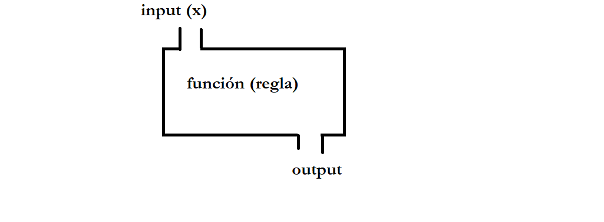
```
]
---

## Funciones (ejemplo) 

```{r ej9bb2, echo = TRUE}
# Supongamos que queremos calcular la media de: 12,24,36,48,60 
(12 + 24 + 36 + 48 + 60)/5 # Calculo directamente la media
data_ej <- c(12, 24, 36, 48, 60) # Genero el vector con los 5 números 
sum(data_ej) / length(data_ej) # Calculo con dos funciones su media
mean(data_ej) # Calculo la media directamente con la función mean()
# También se puede ingresar data directamente en el argumento x
mean(c(12, 24, 36, 48, 60)) 
```

---

## Funciones: R Base

- R viene con un cojunto de [funciones](https://stat.ethz.ch/R-manual/R-devel/library/base/html/00Index.html)  

- Las funciones que vienen "por defecto" son las que escribieron los creadores, al igual que en otros softwares no libres.

- La ventaja de R es que cualquiera puede crear nuevas funciones y publicarlas. Colecciones de funciones (generalmente relacionadas) se llaman "paquetes".

---

## Funciones: argumentos
- Las funciones generalmente cuentan con argumentos que van dentro de los paréntesis.

- La mayoría de las funciones cuentan con el argumento "x" que suele ser el objeto al que le pasaremos la función. Al ser la mayoría de las veces el primer argumento, muchas veces no se explicita: 

```{r ej9bb2_b, echo = TRUE}
media_fun <- mean(data_ej) # Sin explicitar argumento x

media_fun_x <- mean(x = data_ej) # Explicitando argumento x

identical(media_fun, media_fun_x) # El mismo resultado
```

---

## Funciones: argumentos 
- Muchas funciones necesitan más de un argumento para funcionar de forma correcta. 

- Por ejemplo, pensemos en la función `identical()`: "The safe and reliable way to test two objects for being exactly equal. It returns `TRUE` in this case, `FALSE` in every other case.".

- Por definición, `identical()` necesita dos conjuntos de datos distintos, para testear si son iguales.

- En la documentación `help(identical)` podemos ver que cuenta no solo con el argumento x, sino que también con y. 

.codefont[
```{r ej9bb2_c, echo = TRUE}
# Dos maneras de aplicar la función
identical(media_fun, media_fun_x) # por posición
identical(x = media_fun, y = media_fun_x) # por especificación
```
]
---

## Funciones: argumentos 

- A su vez, las funciones muchas veces cuentan con otros argumentos aparte de los datos que usan de insumo. Son detalles de cómo queremos aplicar la regla o el output que recibimos. 

- Volvamos a la función `mean()`. Voy a crear un dataframe con la posición que obtuvo Uruguay en los últimos 5 mundiales de futbol masculino

.codefont[
```{r ej9bb2_d, echo = TRUE}
# Dataframe con el resultado de Uruguuay en los últimos 5 mundiales
uru_mundial <- data.frame(year = c(2002, 2006, 2010, 2014, 2018),
                          posicion = c(26, NA, 4, 12, 5))
# Veamos la posición promedio:
mean(uru_mundial$posicion) 
# Como tenemos un dato perdido, la función nos devuelve NA

# Si especificamos el argumento na.rm (no tener en cuenta los datos perdidos):
mean(uru_mundial$posicion, na.rm = TRUE)

```
]
---

## Funciones: argumentos por defecto

- Es importante entender que la función `mean()` <b> por defecto </b> tiene el argumento `na.rm = FALSE`. De esta forma, si nosotros solamente le pasamos el argumento x, no quitará los datos perdidos. 

- Leer la documentación de las funciones es fundamental, y sobretodo prestar atención a los argumentos por defecto.

---

## Funciones: argumentos 

```{r ej9bb2_e, echo = TRUE, eval = FALSE}
help(mean)
```

.center[
```{r, out.width = "1000px"}

```
]

---

## Funciones y código

Normalmente al transformar datos utilizamos varias funciones. Esto se puede hacer de varias formas:

- Correr funciones de a una, siempre al mismo objeto

- Ir creando objetos intermedios a medida que aplicamos funciones

- Anidar funciones (se aplicará primero la función más al centro y por último la primera desde la izquierda)

- Pipeline ([magrittr](https://magrittr.tidyverse.org/))

---

## Funciones y código: ejemplos 

Supongamos que queremos aplicar dos funciones a un vector númerico: `mean()` para calcular la media y `round()` para redondear el resultado a 1 dígito después de la coma.

.codefontchico[
```{r ej9bb_a, echo = TRUE}
data_ej <- c(12, 21, 33, 41, 27, 23) 

# Correr funciones de una, almismo objeto
resultado_A <- mean(data_ej) # Primero estimo la media
resultado_A <- round(resultado_A, digit = 1) # Redondeo

# Correr funciones de una, con objetos intermedios
resultado_B_1 <- mean(data_ej) # Creo un primer objeto con la media
resultado_B_2 <- round(resultado_B_1, digits = 1) # Creo 2do objeto con la media redondeada

# Corro las dos funciones en la misma línea
resultado_C <- round(mean(data_ej), digits = 1)

# Pruebo que los resultados sean iguales:
identical(resultado_A, resultado_B_2)
identical(resultado_A, resultado_C)
```
]

---

## Crear funciones 

- R permite crear tus propias funciones con facilidad. 

- Esto es muy útil para cuando queremos aplicar determinadas líneas de código a varios objetos distintos.

.center[
```{r, out.width = "700px"}
knitr::include_graphics("ima/function.png")
```
]

.right[Fuente: Grolemund (2014)
]
---

## Crear funciones

Supongamos que tenemos varios dataframes con la cantidad de vacas (en miles) y población (en millones) para un puñado de países en 2017, y que queremos agregar una tercera columna que indique la cantidad de vacas per capita. Estos son los datos que queremos transformar:

.codefont[
```{r ej9bb2_f, echo = FALSE, results="hide"}
data <- data.frame(pais = c("Uruguay", "Argentina", "Brasil", "Mexico"),
                    humanos = c(3.4, 43.8, 209.5, 128.6),
                    vacas = c(11800, 53500, 22600, 16500))

data_2 <- data.frame(pais = c("Uruguay", "Nueva Zelanda", "Australia", "Japón"),
                      humanos = c(3.4, 4.5, 43.8, 126.3),
                      vacas = c(11800, 9900, 53500, 3800))
```

```{r ej9bb2_g, echo = TRUE}
data
data_2
```
]

---

## Crear funciones

.codefont[
```{r ej9bb2_h, echo = TRUE}
# Ahora quiero calcular la cantidad de vacas per capita.
# Podría hacer:

data$vacas_pc <- (data$vacas / 1000) / data$humanos 
data

# Ahora me gustaría tener una tabla un poco más prolija:
# números redondeados y agrego "per"

data$vacas_pc <- round(data$vacas_pc, digits = 1)
data$vacas_pc <- paste(data$vacas_pc, "per", sep = " ")

print(data)
```
]

---

## Crear funciones
Como este paso lo voy a repetir muchas veces, creo una función que llamo `calc_vacas()` que realice todos estos cambios:
.codefont[
```{r ej9bb2_i, echo = TRUE}
calc_vacas <- function(x, y){ 
  vacas_pc <- (x / 1000) / y   # Calculo la proporción de x / 1000 sobre y
  vacas_pc_1 <- round(vacas_pc, digits = 2) # Redondeo
  vacas_pc_2 <- paste(vacas_pc_1, "per", sep = " ")
 return(vacas_pc_2)
}

# Aplico la función a data_2 
data_2$vacas_pc <- calc_vacas(x = data_2$vacas, y = data_2$humanos)
data_2
```
]

---

## Crear funciones

Copiando y pegando código
```{r ej9bb2_j, echo = TRUE}
data$vacas_pc <- (data$vacas / 1000) / data$humanos
data$vacas_pc <- round(data$vacas_pc, digits = 1)
data$vacas_pc <- paste(data$vacas_pc, "per", sep = " ")

data_2$vacas_pc <- (data_2$vacas / 1000) / data_2$humanos
data_2$vacas_pc <- round(data_2$vacas_pc, digits = 1)
data_2$vacas_pc <- paste(data_2$vacas_pc, "per", sep = " ")
```

Con una función
```{r ej9bb2_l, echo = TRUE}
data$vacas_pc <- calc_vacas(x = data$vacas, y = data$humanos)

data_2$vacas_pc <- calc_vacas(x = data_2$vacas, y = data_2$humanos)
```

---

## Errores y advertencias
- Cuando utilizamos funciones podemos encontrarnos con errores (errors) y advertencias (warnings). La principal diferencia entre ellas es que el error implica que la función no se pudo aplicar, mientras que en la advertencia la función fue aplicada pero que algo no funcionó como esperado. También es posible ver mensajes (messages) que simplemente informan algo sobre la función

```{r ej9bb2_m, echo = TRUE, error=TRUE}
vector_ej <- rnorm(n = 10, mean = 10, sd = 5) # Creo valores aleatorios

mean(Vector_ej) # Aplico función para obtener la media
```

.content-box-blue[
*¿A qué se debe este error?*
]

---

## Errores y advertencias

```{r ej9bb2_m3, echo = TRUE, error=TRUE}
vector_ej <- rnorm(n = 10, mean = 10, sd = 5) # Creo valores aleatorios

mean(vector_ej) # Aplico función para obtener la media
```

---

## Errores y advertencias 

En el caso anterior, es sencillo entender porque la función no corrió. Sin embargo, muchas veces podemos no entender que es lo que salió mal y copiar y pegar el error en un buscador de internet es un buen primer paso.

.codefontchico[
```{r ej9bb2_n, echo = TRUE, error=TRUE}
vector_1 <- c("10", "35%", "35", "50") # Vector de caracteres que contiene números 
vector_1
vector_2 <- as.numeric(vector_1) # Transformo a vector númerico
vector_2 # Los valores que además del número tenían (%) no pueden pasarse a númericos
vector_1 <- gsub("%", "", vector_1) # Quito los % del vector original 
vector_1 # Sin valores perdidos
vector_2 <- as.numeric(vector_1) # Transformo a vector númerico
vector_2 # Los valores que además del número tenían (%) no pueden pasarse a númericos
```
]

---

class: inverse, center, middle
# Paquetes

---

## Paquetes 

- Los paquetes son conjuntos de funciones, documentación de ayuda y a veces datos
--

- El conjunto de funciones que vienen por defecto en R se le denomina "Base". Por ej. las funciones que hemos utilizado hasta ahora  -`mean()`, `identical()`, `help()`- están dentro del R Base.
--

- El repositorio principal donde se alojan los paquetes de R se llama Comprehensive R Archive Network [CRAN](https://cran.r-project.org/). Hay más de 10.000 paquetes alojados en CRAN. Aquí hay dos listas con algunos de los paquetes más 
útiles: [support.rstudio](https://support.rstudio.com/hc/en-us/articles/201057987-Quick-list-of-useful-R-packages) y [towardsdatascience](https://towardsdatascience.com/a-comprehensive-list-of-handy-r-packages-e85dad294b3d)  
--

- Los paquetes alojados en CRAN son testados antes de ser publicados. Por eso es recomendable tener cuidado con utilizar paquetes que no han sido publicados allí aún.
--

- Los paquetes normalmente están relacionados a alguna temática, por ejemplo existen paquetes específicos para manipulación de datos [dplyr](https://cran.r-project.org/web/packages/dplyr/dplyr.pdf), visualización de datos [ggplot2](https://cran.r-project.org/web/packages/ggplot2/ggplot2.pdf) o importar y exportar datos [readr](https://cran.r-project.org/web/packages/readr/readr.pdf). Dado que R es libre, cualquier persona puede crear y publicar un paquete (publicarlo en CRAN requiere ciertos procesos igualmente), esto facilita que haya paquetes muy específicos para ciertas tareas que pueden ser de gran utilidad. Por ejemplo, existen paquetes para  conectarse con la API de Twitter [rtweet](https://cran.r-project.org/web/packages/rtweet/rtweet.pdf), para utilizar los datos de [Gapminder](https://cran.csiro.au/web/packages/gapminder/gapminder.pdf) o para analizar datos electorales y de opinión pública en Uruguay [opuy](https://github.com/Nicolas-Schmidt/opuy/blob/master/man/figures/Manual_opuy.pdf)

---

## Paquetes: instalación 
- Cuando abrimos R solamente tenemos cargado por defecto el paquete Base. 

- La primera vez que queremos utilizar un paquete tenemos que descargarlo con el siguiente comando:

```{r ej10, echo = TRUE, results="hide", error=TRUE, eval = FALSE}
# Para descargar paquetes de CRAN, utilizamos la siguiente función:
install.packages("nombre_del_paquete")
install.packages("dplyr") # Ejemplo

# Existen otros paquetes no alojados en CRAN, que se instalan con
# el paquete "devtools" 
```

---

## Paquetes: cargar 
- Luego de instalarlo (una sola vez por versión de R), tenemos que cargar el paquete utilizando la función `library()`


- Esto lo debemos realizar en cada sesión de R que vayamos a utilizar (cada vez que abrimos R). 
```{r ej10_a, echo = TRUE,  eval = FALSE}
library(nombre_del_paquete)
library(dplyr) # Ejemplo
```

---

## Paquetes
En ocasiones los paquetes tienen funciones que se llaman igual, lo que puede llevar a errores. En estos casos -una vez instalado el paquete- podemos usar una función sin cargar el paquete de la siguiente manera:

.codefont[
```{r ej10_b, echo = TRUE,  results="hide", error=TRUE}
df_1 <- data.frame(col_a = c(1, 2, 3),
                   col_b = c(2, 4, 6))

df_2 <- data.frame(col_a = c(1, 2, 3),
                   col_c = c(-2, 1, 6))

# Uso la función rbind.fill() que a diferencia de rbind() del Base, 
# permite unir datafranes con columnas que no matchean de forma exacta,
# agregando NAs

# No cargo todo el paquete plyr sino que llamo la función específica usando ::
df_3 <- plyr::rbind.fill(df_1, df_2)
```
]

---
class: inverse, center, middle
# Operadores

---

## Operadores aritméticos 

```{r ej11, echo = FALSE}
tabla2 <- data.frame(Operador=c("+", "-", "*", "%", "^"),
                     Descripcion=c("Suma", "Resta", "Multiplicación", "División", "Potencia"),
                     Ejemplo=c("2+2", "2-2", "2*2", "2%2", "2^3"),
                     Resultado=c("4", "0", "4", "1", "8"))
tabla2 %>%
  kbl() %>%
  kable_styling(bootstrap_options = c("striped", "hover", "condensed"), font_size = 20)

```
---

## Operadores relacionales 

```{r ej11b, echo = FALSE}
tabla3 <- data.frame(Operador=c("<", ">", "<=", ">=", "%in%", "==", "!="),
                     Descripcion=c("Menor a", "Mayor a", "Menor o igual a", "Mayor o igual a",
                                   "Está incluido dentro de","Igual a", "Distinto a"),
                     Ejemplo=c("4 < 4", "6 > 2", "4 <= 4", "6 >= 2", "2 %in% c(0, 1, 2)","hola == hello", "hola != hello"),
                     Resultado=c("FALSE", "TRUE", "TRUE", "TRUE", "TRUE", "FALSE", "TRUE"))
tabla3 %>%
  kbl() %>%
  kable_styling(bootstrap_options = c("striped", "hover", "condensed"), font_size = 20)

```

---

## Operadores booleanos

```{r ej11c, echo = FALSE}
tabla4 <- data.frame(Operador=c("a & b ", "a | b", "!a", "isTrue(a)"),
                     Prueba=c("a y b son verdaderos", "al menos una de a o b son verdaderas", "a no es verdadera", "a es verdadera"))
tabla4 %>%
  kbl() %>%
  kable_styling(bootstrap_options = c("striped", "hover", "condensed"), font_size = 20)

```
