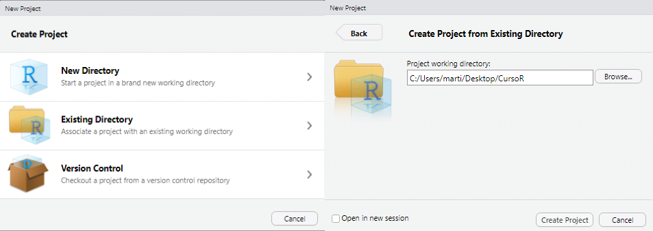
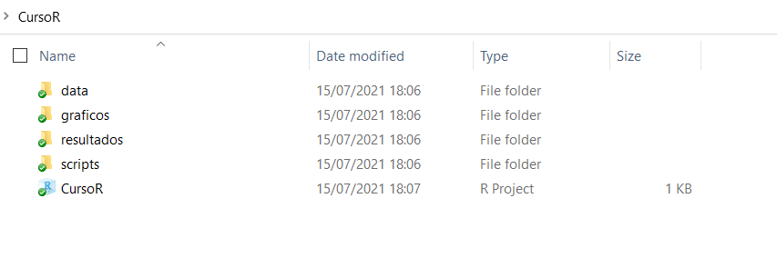

class: inverse, center, middle

```{r setup, include=FALSE}
library(xaringanthemer)
library(kableExtra)
library(xaringan)
library(tidyverse)
library(data.table)
library(xaringanExtra)

style_duo_accent(primary_color = "#035AA6",
                 secondary_color = "#507786",
                 text_font_family = "Droid Serif",
                 text_font_url = "https://fonts.googleapis.com/css?family=Droid+Serif:400,700,400italic",
                 header_font_google = google_font("Yanone Kaffeesatz"),
                 text_slide_number_color = "#000000")
knitr::opts_chunk$set(echo = FALSE)
options("kableExtra.html.bsTable" = T)

htmltools::tagList(
  xaringanExtra::use_clipboard(
    button_text = "<i class=\"fa fa-clipboard\"></i>",
    success_text = "<i class=\"fa fa-check\" style=\"color: #90BE6D\"></i>",
    error_text = "<i class=\"fa fa-times-circle\" style=\"color: #F94144\"></i>"
  ),
  rmarkdown::html_dependency_font_awesome()
)
xaringanExtra::use_xaringan_extra(c("tile_view", "animate_css", "tachyons"))
xaringanExtra::use_scribble()
use_extra_styles(
  hover_code_line = TRUE,         
  mute_unhighlighted_code = TRUE
  )  
```

# Directorios de trabajo y proyectos de R (.Rproj)

---

## Directorios de trabajo 
- Para abrir en R un archivo guardado en tu computadora, debes especificar en qué carpeta está guardado, para esto hay varias opciones. Primero, puedes fijar un directorio por defecto:

.codefont[
```{r ej4, echo = TRUE, results = "hide", error=TRUE, eval = FALSE}
# Puedo fijar el directorio de trabajo con la función setwd()
# Fijar la carpeta donde vamos a importar y exportar los archivos:
setwd("micompu/micarpeta") 
getwd() # Con está función puedo consultar el directorio
```
]

.codefont[
```{r ej5, echo = TRUE, error=TRUE}
# Ahora, si quiero leer un archivo que esté en "micompu/micarpeta" simplemente 
# escribo su nombre dentro de la función, en el lugar del "path".

# Supongamos que tengo dentro de la carpeta "micarpeta" un excel con datos
# de desempleo en Uruguay:

library(readxl)
desempleo_uru <- read_excel("data/desempleo.xlsx")
head(desempleo_uru, 4)
```
]
---

## Directorios de trabajo 
También podemos no fijar un directorio para la sesión e ir especificando los directorios completos dentro de cada función:

```{r ej6, echo = TRUE, error=TRUE, results = "hide", eval = FALSE}
desempleo_uru <- read_excel("micompu/micarpeta/data/desempleo.xlsx")
```

---

## Proyectos de R (.Rproj)

- La mejor práctica para que nuestros scripts sean portables y reproducibles, es utilzar R Projects (`.Rproj`). 

- Para crear un `.Rproj` vamos a `File/New Project` y ahí nos encontramos con la opción de crear una carpeta para guardar los archivos o utilizar una carpeta ya existente.

- Al crear un proyecto de R se creará un archivo de extensión `.Rproj`, cuando le damos click se inicia una nueva sesión de R cuyo directorio es por defecto la carpeta en la que está guardado. 

- Podemos usar directorios relativos dentro de la carpeta en la que se aloja nuestro `.Rproj` para importar y exportar datos a y desde R. Esto hace que uno pueda cambiar la carpeta o compartirla y el script correrá de igual manera (a diferencia de si utilizamos `setwd()`)

---

## Proyectos de R (.Rproj) 
<ol>
<li> Creen una carpeta para guardar el material del curso 
<li> Descarga de la webasignatura las carpetas "Data" y las carpetas "scripts" de los días 1 y 2. Pegalas en la carpeta del punto 1 (guarda todos los scripts dentro de la misma carpeta)
<li> Crea además dos carpetas más dentro de tu carpeta: "graficos" y "resultados"
<li> Abran RStudio y desde ahí creen un `.Rproj`, desde existing directory, seleccionando la carpeta del punto 1
</ol>

.center[
```{r ej7, out.width = "700px"}

```
]
---

## Proyectos de R (.Rproj) 
<ol start=5>
<li> Deberían ver en su carpeta algo así:
</ol>

.center[
```{r ej7_b, out.width = "1000px"}

```
]

---

## Proyectos de R (.Rproj)
<ol start=6>
<li> Abran el archivo `.Rproj` y desde ahí usando File/Open File abren los scripts dentro de la carpeta "scripts". Es importante que los abran desde la sesión que inicia el proyecto y no directamente haciendo click en el script.
<li> Ya estamos listos para empezar!
</ol>

---
class: inverse, center, middle

# Dialectos

---
## Ejercicio 

.content-box-blue[
*Supongamos que tengo estos datos:*
]

```{r ej2a, echo = FALSE, results='hide'}
library(readxl)
library(tidyverse)
library(data.table)
datauru <- read_excel("data/datauru.xlsx")
data <- select(datauru, year, gdp_lcu, inflation, unemployment, presidente)
```

```{r ej2b, echo = TRUE}
data
```
---

## Ejercicio 

.content-box-blue[
*¿Qué quiero hacer con el código debajo?*
]

.codefont[
```{r ej2c, echo = TRUE, eval = FALSE}
as.data.frame(t(sapply(X = split(
  x = data[which(data$presidente %in% c("Vázquez", "Sanguinetti")),
           which(colnames(data) %in% c("gdp_lcu", "inflation"))],
  f = data$presidente[which(data$presidente %in% c("Vázquez", "Sanguinetti"))],
  drop = TRUE),
  FUN = function(x) {apply(x, 2, mean)})))
```
]

---
## Ejercicio 

.content-box-blue[
*¿Qué quiero hacer con el código debajo?*
]

```{r ej2e, echo = TRUE, eval = FALSE}
data_dt <- data 

setDT(data_dt) 

data_dt[presidente %in% c("Vázquez", "Sanguinetti"),
       c("presidente", "gdp_lcu", "inflation")  ][ 
         , lapply(.SD, mean), by = presidente] 
```

---
## Ejercicio 

.content-box-blue[
*¿Qué quiero hacer con el código debajo?*
]

```{r ej2d, echo = TRUE, eval = FALSE}
data %>%
  filter(presidente %in% c("Vázquez", "Sanguinetti")) %>% 
  select(presidente, gdp_lcu, inflation) %>%
  group_by(presidente) %>% 
  summarise_all(mean) 

```

---
## R Base 

```{r ej2f, echo = TRUE}
as.data.frame(t(sapply(X = split(
  x = data[which(data$presidente %in% c("Vázquez", "Sanguinetti")),
           which(colnames(data) %in% c("gdp_lcu", "inflation"))],
  f = data$presidente[which(data$presidente %in% c("Vázquez", "Sanguinetti"))],
  drop = TRUE),
  FUN = function(x) {apply(x, 2, mean)})))
```

---
## Data.table 

```{r ej2g, echo = TRUE}
data_dt <- data 
setDT(data_dt) 
data_dt[presidente %in% c("Vázquez", "Sanguinetti"),
       c("presidente", "gdp_lcu", "inflation")  ][ 
         , lapply(.SD, mean), by = presidente] 
```

---
## Tidyverse

```{r ej2h, echo = TRUE}
data %>%
  filter(presidente %in% c("Vázquez", "Sanguinetti")) %>% 
  select(presidente, gdp_lcu, inflation) %>%
  group_by(presidente) %>% 
  summarise_all(mean) 

```

---

## Dialectos
- Como vimos, en R podemos realizar una misma operación de muchas maneras distintas. Puesto de otra manera, R como lenguaje de programación tiene distintos "dialectos", esto es, paquetes (o conjuntos de paquetes) con sus propias funciones, sintaxis y comunidad de usuarios. 

- Para la mayoría de las funciones requeridas para un análisis de datos estándar (importar datos, manipular, modelar y visualizar) existen -de forma muy simplificada- tres grandes dialectos: [R Base](https://stat.ethz.ch/R-manual/R-devel/library/base/html/00Index.html), [tidyverse](https://www.tidyverse.org/) y [data.table](https://rdatatable.gitlab.io/data.table/).

- Tidyverse es una colección de paquetes diseñados para el análisis de datos. Este conjunto de paquetes comparte una filosofía de diseño, grámatica y estructura de datos. 

- Las ventajas de Tidyverse están en su gramática (fácil de leer lo que invita a compartir y replicar), consistencia, alcance y su numerosa y creciente comunidad.

```{r ej1, echo = FALSE, results='hide'}
encuesta <- data.frame(edad = c(18,24,80), 
                       ideologia = c("Izquierda", "Izquierda", "Derecha"),
                       voto = c("Partido A", "Partido A", "Partido C"))
```

---

## Dialectos (ejemplo) 

.codefontchico[
```{r ej2, echo = TRUE}
encuesta # Retomemos el data.frame "encuesta"
# Supongamos que quiero quedarme solo con las variables de edad y voto

encuesta_base <-  encuesta[ , c("edad", "voto")] # R Base
colnames(encuesta_base)
encuesta_dt <- as.data.table(encuesta)[ , .(edad, voto)] # Datatable
colnames(encuesta_dt)
encuesta_tidy <- select(encuesta, edad, voto) # Tidyverse
colnames(encuesta_tidy)
```
]
---
class: inverse, center, middle

# Tidyverse

---

## Tidyverse 


Tidyverse cuenta con varios paquetes que sirven para distintos tipos de tareas específicas. Podemos cargar todos los paquetes de forma conjunta: 

.codefont[
```{r ej00, echo = TRUE, results='hide', error=TRUE}
 # install.packages("tidyverse")
library(tidyverse)

# install.packages("dplyr")
library(dplyr)
```
]

.center[
```{r ej0, out.width = "200px"}
knitr::include_graphics("ima/tidy.jpg")
```
]
---

## Tidyverse 
La mejor manera de entender los principios de tidyverse es a través del libro del creador de tidyverse (Hadley Wickham) y Garrett Grolemund "R for Data Science" (2018). 

.center[
```{r ej0_b, out.width = "600px"}
knitr::include_graphics("ima/tidy_pr.png")
```
]

---

## Tidyverse: paquetes 

.pull-left[Paquetes que Tidyverse carga: 

- [readr](https://readr.tidyverse.org/): importar y exportar datos
- [dplyr](https://dplyr.tidyverse.org/): manipulación de datos
- [tidyr](https://tidyr.tidyverse.org/): manipulación de datos
- [ggplot2](https://ggplot2.tidyverse.org/): visualización de datos
- [purr](https://purrr.tidyverse.org/): programación avanzada
- [tibble](https://tibble.tidyverse.org/): estructura de datos
- [forcats](https://forcats.tidyverse.org/): factores
- [stringr](https://stringr.tidyverse.org/): variables de caracteres
]

.pull-right[
```{r ej0_a, out.width = "500px"}

```
]
---

## Tidyverse: paquetes
Estos son algunos paquetes (para tareas más específicas) que forman parte del Tidyverse pero se tienen que cargar por separado:

- [readxl](https://readxl.tidyverse.org/): importar datos (excel)
- [haven](https://haven.tidyverse.org/): importar (Stata, SPSS, SAS)
- [lubridate](https://lubridate.tidyverse.org/): manipulación de fechas
- [rvest](https://rvest.tidyverse.org/): webscrapping
- [glue](https://www.tidyverse.org/blog/2017/10/glue-1.2.0/): combinar data
- [tidymodels](https://www.tidymodels.org/): modelar datos


---
class: inverse, center, middle

# Importar y exportar datos

---

## Importar datos
- Hasta ahora trabajamos principalmente con datos ingresados manualmente con las funciones `c()` y `data.frame()`

- Normalmente cuando trabajamos con datos solemos utilizar datos ya creados guardados en los formatos de otros programas (ej. Excel, Stata, SPSS) 

- Existen varios paquetes que permiten importar y exportar datos desde distintos formatos. Algunos de los más utilizados son [readr](https://readr.tidyverse.org/), [haven](https://haven.tidyverse.org/), [readxl](https://readxl.tidyverse.org/) y [utils](https://www.rdocumentation.org/packages/utils/versions/3.6.2)

---

## Importar datos 
Distintas funciones nos sirven para importar datos a R desde distintos formatos. Veamos algunos ejemplos:

.codefont[
```{r ej8, echo = TRUE, results="hide", message=FALSE, warning=FALSE}
# Con la función read_csv() del paquete readr importamos archivos .csv
library(tidyverse)
gapminder_csv <- read_csv("data/gapminder.csv")

# Con la función read_excel() del paquete readxl importamos archivos excel
library(readxl)
gapminder_excel <- read_excel("data/gapminder.xlsx")

```
]

.codefont[
```{r ej8_b, echo = TRUE}
# Vemos que los dataframes son iguales, tienen la mismas filas y columnas
dim(gapminder_csv)
dim(gapminder_excel)
```
]
---

## Importar datos
Algunos paquetes incluyen datos, por ejemplo, gapminder. En la documentación del paquete se encuentra el nombre de los datos. Con una simple asignación los podemos cargar 
```{r ej9, echo = TRUE, message=FALSE, warning=FALSE}
library(gapminder)

data_gapminder <- gapminder
head(data_gapminder)
```

---

## Importar datos
También es posible importar datos guardados en los formatos de otros softwares estadísticos como SPSS o Stata. Para esto usaremos el paquete haven.

.codefont[
```{r ej10, echo = TRUE}
library(haven)

# SPSS
gapminder_spss <- read_spss("data/gapminder.sav") 

# STATA
gapminder_stata <- read_stata("data/gapminder.dta") 
```
]

O podríamos llamar a la función y paquete dado que generalmente solo utilizamos una función de los paquetes que cargan datos (depende del caso obviamente)

.codefont[
```{r ej10bb, echo = TRUE}
# SPSS
gapminder_spss <- haven::read_spss("data/gapminder.sav") 

# STATA
gapminder_stata <- haven::read_stata("data/gapminder.dta") 
```
]

---

## Importar datos 
R también cuenta con sus propios formatos de almacenamiento de datos (`.rds` y `.Rdata` o `.rda`). Este enfoque es poco práctico si queremos usar los datos almacenados en otro programa, pero muy útil si solamente usaremos R dado que mantiene la información tal cual estaba en R (por ej. tipos de variables o atributos):

.codefont[
```{r ej11, echo = TRUE}
# Para esto no necesitamos cargar paquetes. 
# Guardar un objeto como .rds:
saveRDS(object = data_gapminder,
        file = "resultados/data_gapminder.rds") 

 # Leemos un archivo .rds
miobjeto_rds <- readRDS(file = "resultados/data_gapminder.rds")

# Con .rda se pueden guardar varios objetos al mismo tiempo!
# Exportamos un archivo .Rdata
save(data_gapminder, miobjeto_rds,
     file = "resultados/dos_dataframes.Rdata") 

 # Importamos un archivo .Rdata
load("resultados/dos_dataframes.Rdata")
```
]

---

## Exportar datos 
- También podemos guardar archivos desde R en otros formatos. 
- Con [readr](https://readr.tidyverse.org/) podemos exportar archivos en formato .csv 
- Con [writexl](https://cran.r-project.org/web/packages/writexl/writexl.pdf) podemos exportar directamente un excel.
- Con [haven](https://www.rdocumentation.org/packages/haven/versions/2.3.1) podemos exportar achivos en formato .dta (Stata) y .sav (SPSS)

.codefont[
```{r ej12, echo = TRUE}
# Guardar .csv
library(gapminder)
data_gapminder <- gapminder
write_excel_csv(data_gapminder, "resultados/gapminder.csv")

# Guardar excel
library(writexl)
write_xlsx(data_gapminder, "resultados/gapminder.xlsx")

# Guardar .dta (Stata)
library(haven)
write_dta(data_gapminder, "resultados/gapminder.dta")

# Guardar .sav (SPSS)
write_sav(data_gapminder, "resultados/gapminder.sav")

# Guardar .sas (SAS)
write_sas(data_gapminder, "resultados/gapminder.sas")
```
]
---

## Importar y exportar datos

.bold[Argumentos a tener en cuenta:]

- .bold[Nombre de columnas:] a veces debemos especificar si queremos que la primera fila de nuestros datos sean el nombre de las variables

- .bold[Nombre de filas:] de igual manera, a veces podemos especificar si queremos que la primera columna sea el nombre de las filas (sirve para identificadores de caso por ej.)

- .bold[Etiquetas de variables:] cuando los datos que queremos importar tienen etiquetas (pasa mucho en encuestas) podemos cargarlas como etiquetas o cargar solamente la etiqueta como cadena o factores. Ver capítulo 4 de Urdinez, F. & Labrin, A. (Eds.) (2020)

- .bold[Append:] algunas funciones permiten agregar filas debajo de un archivo (esto es muy útil para ir actualizando bases de datos)

---

## Etiquetas cuando importamos datos

- Cuando importamos datos que tienen etiquetas (por ejemplo de formatos como Stata o SPSS) debemos tener cuidado con cómo manejar estas etiquetas

- Por ejemplo, supongamos que queremos leer los datos de una encuesta con dos variables, guardada en formato Stata (`.dta`), con el paquete `haven`:

.codefont[
```{r ej13bb, echo = TRUE}
data <- haven::read_stata("data/ej_encuesta.dta")
head(data, 5)
```
]

- Por defecto se leen como variables de tipo `double` (numérica) con etiquetas como atributos

---

## Etiquetas cuando importamos datos

Si queremos quedarnos directamente coon las etiquetas, podemos utilizar la funcion `as_factor`:

```{r ej13bc, echo = TRUE}
data <- haven::read_stata("data/ej_encuesta.dta") %>% 
  as_factor()
head(data, 5)
```

---

## Importar y exportar datos: factores

- Otro tipo de variables en R son los factores (factors), utilizados para representar data categórica. Estos suelen confundirse con las variables de caracteres pero tienen algunas diferencias. 

- Normalmente los factores son utilizados para las variables de caracteres con un número de valores posibles fijo y cierto orden (opcional)

- A R le gusta transformar las variables de caracteres en factores al importarlas (si usamos R Base particularmente).

- El paquete [forcats](https://forcats.tidyverse.org/) (dentro del Tidyverse) ayuda a manejar variables de caracteres y factores:
    - `fct_relevel()` cambia manualmente el orden de los niveles
    - `fct_reoder()` cambia el orden de los niveles de acuerdo a otra variable
    - `fct_infreq()` reordena un factor por la frecuencia de sus valores 
    - `fct_lump()` collapsa los valores menos frecuentes en otra categoría "other". Es muy útil para preparar datos para tablas y gráficos

---

## Importar y exportar datos: factores 

.codefontchico[
```{r ej13, echo = TRUE}
# Podemos chequear y coercionar factores
data_gapminder <- gapminder
is.factor(data_gapminder$continent) # Chequeo si es factor
levels(data_gapminder$continent) # Chequeo los niveles
# Transformo a caracter
data_gapminder$continent <- as.character(data_gapminder$continent) 
class(data_gapminder$continent)
# De vuelta a factor
data_gapminder$continent <- as.factor(data_gapminder$continent)
class(data_gapminder$continent)
```
]

---

## Importar y exportar datos: factores 

.codefont[
```{r ej14, echo = TRUE}
# Para crear un factor usamos la función factor()
paises_mercosur <- factor(c("Argentina", "Brasil", "Paraguay", "Uruguay"))
table(paises_mercosur)
# La función fct_relevel() nos permite reordenar los niveles del factor
paises_mercosur <- fct_relevel(paises_mercosur, "Uruguay")
table(paises_mercosur)
```
]

---

## Ejercicio

.content-box-blue[
*En la carpeta data encontrarán un archivo excel llamado "urudata_sheets", leer la segunda hoja del archivo*
]

---
class: inverse, center, middle

# Dataframes 

---

## Dataframes: tibbles
- La mayoría de los análisis de datos convencionales contienen dataframes. Cuando usamos los paquetes del tidyverse, generalmente trabajamos con "tibbles", que es muy similar a un dataframe pero con pequeños cambios. 

- Una de las principales diferencias es la forma en que se imprimen los datos.

- La mayoría de las funciones del Tidyverse devuelven un tibble.

.codefont[
```{r ej15, echo = TRUE}
data_gapminder <- (gapminder)
class(data_gapminder) # Ya es un tibble 
data_gapminder <- as.data.frame(data_gapminder)
class(data_gapminder) # Ahora solamente dataframe
```
]

---

## Dataframes: imprimir dataframe 

.codefont[
```{r ej15b, echo = TRUE}
print(data_gapminder)
```
]
---

## Dataframes: imprimir tibble 

.codefont[
```{r ej16, echo = TRUE}
data_gapminder <- as_tibble(data_gapminder) # Pasamos nuevamente a tibble
class(data_gapminder)
print(data_gapminder)
```
]

---

## Tidy dataset
- Hay muchas formas de estructurar un conjunto de datos. El enfoque tidy sugiere que cada variable sea una columna y cada observación sea una fila, por lo que cada valor tiene su propia celda:

.center[
```{r ej17, out.width = "1000px"}
knitr::include_graphics("ima/tidy_data.png")
```
]

.right[[Wichkham & Grolemund (2018)](https://r4ds.had.co.nz/tidy-data.html)]

---

## Nombres de variables

Muchas veces los usamos datos que no están documentados de manera uniforme o apropiada, por ejemplo, con nombres dispares y propensos a errores en las columnas.

[Janitor](https://garthtarr.github.io/meatR/janitor.html#catalog_of_janitor_functions) es un paquete orientado al estilo Tidyverse (aunque no pertenece) que facilita algunas funciones para limpiar y explorar datos. 

```{r ej17_a, results='hide', echo=FALSE}
ejemplo <- data.frame(COLORES = c("Verde", "Rojo", "Azul"),
                      NombresCompletos = c("María S.", "Juan F.", "Pedro A."),
                      edad_NUMERICA = c(32, 23., 24))
```

.codefont[
```{r ej17_b, warning=FALSE, message=FALSE, echo = TRUE}
ejemplo

library(janitor)

ejemplo_clean <- clean_names(ejemplo)
ejemplo_clean
```
]


---
class: inverse, center, middle

# Explorar datos

---

## Resumen de un dataframe

.codefont[
```{r ej18, eval = FALSE}
# R tiene un visor para datos. Pueden dar click en el dataframe en el ambiente o:
view(data_gapminder)
```
]

.codefont[
```{r ej18b, echo = TRUE}
dim(data_gapminder) # Número de filas y columnas
names(data_gapminder) # Nombre de variables
head(data_gapminder, 3) # Imprime primeras filas (3 en este caso)
```
]

---

## Resumen de un dataframe
.codefont[
```{r ej19, echo = TRUE}
# Estructura del dataframe
str(data_gapminder) 
```
]

---

## Resumen de un dataframe 
```{r ej19b, echo = TRUE}
# Pequeño resumen de las variables:
summary(data_gapminder) 
```

---

## Resumen de un dataframe 

Una de las funciones más utiles para resumir un dataframe es `glimpse()` del paquete dplyr o tidyverse. Es particularmente util debido a que permite un vistazo al nombre, tipo y primeros valores de .bold[todos] las variables de un dataframe.

```{r ej19bc, echo = TRUE}
# Resumen más completo:
glimpse(gapminder) 
```

---
## Tablas

En R Base la función para obtener frecuencias es `table()` junto con `prop.table()` y `addmargins()`

.codefontchico[
```{r ej19b_2, echo = TRUE}
# Para obtener una tabla de frecuencias de una variable usamos la función
# table() de R Base
tabla_1 <- table(data_gapminder$continent) # Frecuencia simple
tabla_1 

prop.table(tabla_1) # Proporciones

addmargins(tabla_1) # Totales

addmargins(prop.table(tabla_1)) # Proporciones y totales
```
]

---
## Tablas 

Para obtener tablas que cruzen dos variables podemos nuevamente usar `table()` especificando dos variables.


```{r ej19b_3, echo = FALSE}
data_gapminder$mercosur <- ifelse(data_gapminder$country == "Uruguay", 1,
                                  ifelse(data_gapminder$country == "Argentina", 1,
                                         ifelse(data_gapminder$country == "Paraguay", 1,
                                                ifelse(data_gapminder$country == "Brazil", 1,
                                                       0))))
```

.codefont[
```{r ej19b_4, echo = TRUE}
tabla_2 <- table(data_gapminder$continent, data_gapminder$mercosur)
tabla_2

prop.table(tabla_2)
```
]


---
## Tablas

.codefont[
```{r ej19b_6, echo = TRUE}
# Totales por columna o fila

tabla_2 <- table(data_gapminder$continent, data_gapminder$mercosur)

addmargins(tabla_2, 1) # Total por columna
addmargins(tabla_2, 2) # Total por fila
```
]


---
## Tablas

.codefont[
```{r ej19b_5, echo = TRUE}
# Editar nombres de columnas

tabla_2 <- table(data_gapminder$continent, data_gapminder$mercosur)
tabla_2

colnames(tabla_2) <- c("No mercosur", "Mercosur")
tabla_2

```
]

---
class: inverse, center, middle

# Estadística descriptiva

---

## Medidas de tendencia central 

.codefont[
```{r ej20, echo = TRUE}
mean(data_gapminder$lifeExp) # Media
median(data_gapminder$lifeExp) # Mediana
sd(data_gapminder$lifeExp) # Desvío estandar
```
]

---

## Rangos 

```{r ej21, echo = TRUE}
range(data_gapminder$lifeExp) # Rango
max(data_gapminder$lifeExp)
min(data_gapminder$lifeExp)
```

---

## Histogramas 
También podemos graficar los datos rápidamente. Por ejemplo, un histograma:

.center[
.codefont[
```{r ej22, echo = TRUE,  out.width = '400px'}
hist(data_gapminder$lifeExp,
     main = "Distribución de expectativa de vida (Gapminder)")
```
]
]
---

## Gráfico de dispersión (scatterplot) 

.center[
```{r ej22_b, echo = TRUE,  out.width = '400px'}
plot(data_gapminder$lifeExp, data_gapminder$gdpPercap,
     main = "Relación entre expectativa de vida y PBI per cápita")
```
]

---

## Cuantiles
.codefont[
```{r ej23, echo = TRUE}
quantile(data_gapminder$lifeExp, probs=c(0.2, 0.4, 0.8)) # Cuantiles
quantile(data_gapminder$lifeExp, probs=seq(0, 1, 0.2)) # Cuantiles

# Con la función ntile() de dplyr podemos asignar quintiles en una variable
data_gapminder$lifeExp_quant <- ntile(data_gapminder$lifeExp, 5)

# Tabla cruzada 
table(data_gapminder$continent, data_gapminder$lifeExp_quant)
```
]

---
class: inverse, center, middle

# Crear y recodificar variables 

---

## Crear variables con mutate() 
El paquete [dplyr](https://cran.r-project.org/web/packages/dplyr/dplyr.pdf) contiene la función [`mutate()`](https://www.rdocumentation.org/packages/dplyr/versions/0.5.0/topics/mutate) para crear nuevas variables. `mutate()` crea variables al final del dataframe.

.codefont[
```{r ej25, echo = TRUE}
data_gapminder <- as_tibble(gapminder) # Pasamos nuevamente a tibble

# Variable de caracteres
data_gapminder <- mutate(data_gapminder, var1 = "Valor fijo") 

# Variable numérica
data_gapminder <- mutate(data_gapminder, var2 = 7) 
head(data_gapminder, 3)

## Podemos escribir lo mismo de distinta manera:
data_gapminder <- mutate(data_gapminder, var1 = "Valor fijo",
                                         var2 = 7)
```
]

---

## Crear variables en R Base
Estas transformaciones también laspodríamos haber hecho en R Base
.codefont[
```{r ej25_B, echo = TRUE}
d_gap <- gapminder

d_gap$var1 <- "Valor fijo"

d_gap$var2 <- 7

head(d_gap, 3)
```
]
---

## Recodificar una misma variable 
.codefont[
```{r ej25_C, echo = TRUE}
## También tenemos dos maneras de recodificar una misma variable
# Con dplyr
data_uru <- filter(gapminder, country == "Uruguay")
data_uru <- mutate(data_uru, country =  "ROU")
head(data_uru, 3)
# En R Base
data_uru <- filter(gapminder, country == "Uruguay")
data_uru$country <- "ROU"
head(data_uru, 3)
```
]

---

## Recodificar variables con mutate() 
.codefont[
Con `mutate()` también podemos realizar operaciones sobre variables ya existentes:
```{r ej26, echo = TRUE}
## Podemos recodificar usando variables y operadores aritméticos
# Calculemos el pbi total (pbi per capita * población)
d_gap <- mutate(gapminder, gdp = gdpPercap * pop)
head(d_gap, 3)
# Podemos calcular el logaritmo 
d_gap <- mutate(d_gap, gdp_log = log(gdp))
head(d_gap, 2)
```
]

---

## Adelantar y retrasar variables 

.codefont[
```{r ej27, echo = TRUE}
## Podemos retrasar -lag()- o adelantar -lead()- variables
# Primero nos quedamos con los datos de Uruguay
# Atrasamos un período el pbi per capita
data_uru <- filter(gapminder, country == "Uruguay") 
data_uru <- mutate(data_uru, gdpPercap_lag = lag(gdpPercap, n=1))
head(data_uru, 4)
# Adelantamos dos períodos el pbi per cápita 
data_uru <- mutate(data_uru, gdpPercap_lead2 = lead(gdpPercap, n=2))
head(data_uru, 4)
```
]

---

## Rankings e identificadores 

.codefont[
```{r ej28, echo = TRUE}
 # Identificador (números consecutivos)
d_gap <- mutate(gapminder, id = row_number())
head(d_gap, 4)

# Ranking según variable
d_gap <- mutate(d_gap, gdp_rank = row_number(gdpPercap)) 

# Ordeno los datos según el ranking
d_gap <- arrange(d_gap, desc(gdp_rank)) 
head(d_gap, 4)
```
]

---

## Transformaciones de tipo 

Al igual que hacíamos con los vectores, podemos tranformar el tipo de una variable 

```{r ej2bcsb, echo = FALSE}
d_gap <- select(gapminder, continent, year, lifeExp)
```

.codefont[
```{r ej28bb, echo = TRUE}
# Exploro tipo de variables
glimpse(d_gap)

# Variable continente a caracteres y año a factor
d_gap <- d_gap %>% 
  mutate(continent = as.character(continent),
         year = as.factor(year))

glimpse(d_gap)
```
]

---

## Transformaciones de tipo 

.codefont[
```{r ej28bbd, echo = TRUE}
# Variable año a numérica nuevamente
d_gap <- d_gap %>% 
  mutate(year = as.numeric(year))

glimpse(d_gap)
```
]

```{r ej2sdsdbcsb, echo = FALSE}
d_gap <- gapminder
```


---
class: inverse, center, middle

# Recodificaciones condicionales

---

## Recodificaciones condicionales
- Muchas veces transformar los datos implica recodificar una variable de forma condicional, esto es, asignar distintos valores en función de los valores de una o más variables.

- Para esto utilizaremos las funciones [ifelse()](https://www.rdocumentation.org/packages/base/versions/3.6.2/topics/ifelse) (R Base), [mutate()](https://www.rdocumentation.org/packages/dplyr/versions/0.5.0/topics/mutate), [recode()](https://www.rdocumentation.org/packages/dplyr/versions/0.7.8/topics/recode) y [case_when()](https://dplyr.tidyverse.org/reference/case_when.html) (Tidyverse)

---
## Recodificación condicional con recode y mutate

dplyr también cuenta con la función `recode()` para recodificar variables. Esta función permite recodificar valores de forma sencilla, basado en sus nombres (no permite operaciones complejas). 

Primero especificamos el dataframe, luego el nombre de la variable (nombre disitnto si queremos crear una nueva variable, o el mismo y si queremos sobreeescribirla), luego el nombre de la variable original y por último los cambios.

De forma general:

.codefont[
```{r ej28h2, eval = FALSE, echo = TRUE}
dataframe <- mutate(dataframe, 
                    var_nueva = recode(var_original,
                                       "Valor 1" = "Valor A",
                                       "Valor 2" = "Valor B"))
```
]

---
## Recodificación condicional con recode y mutate

Cuando usamos `recode()` para recodificar factores debemos o especificar cada uno de los niveles o usar la opción `.default = levels(variable_original)`

.codefont[
```{r ej28h4, echo = TRUE}
table(d_gap$continent)
class(d_gap$continent)
d_gap <- mutate(d_gap,
                continent_sigla = recode(continent,
                                         "Africa" = "AF",
                                         "Americas" = "AM",
                                         .default = levels(continent)))
table(d_gap$continent_sigla)
```
]

---
## Recodificación condicional con recode y mutate

```{r ej283_bb, echo = TRUE}
# Especificando todos los valores:
d_gap <- mutate(d_gap,
                continent_sigla2 = recode(continent,
                                          "Africa" = "AF",
                                          "Americas" = "AM",
                                          "Asia" = "AS",
                                          "Europe" = "EU",
                                          "Oceania" = "OC"))
table(d_gap$continent_sigla2)
```


---

## Recodificación condicional con recode y mutate

Cuando usamos `recode()` para recodificar variables de caracteres simplemente especificamos los valores que queremos recodificar

.codefont[
```{r ej28i, echo = TRUE}
d_gap$continent <- as.character(d_gap$continent) 
class(d_gap$continent)
d_gap <- mutate(d_gap, 
                continent_sigla3 = recode(continent,
                                          "Africa" = "AF",
                                          "Oceania" = "OC"))
table(d_gap$continent_sigla3)
```
]

---

## Recodificación condicional con case_when y mutate

`recode()` es muy útil para cuando queremos recodificar los valores de una variable de forma puntual, pero no me permite operaciones más complejas como crear una variable condicional basada en dos variables distintas. Para ello dplyr tiene la función `case_when()`. Esencialmente, con `ifelse()` (R Base) podemos lograr lo mismo que con `case_when()` (Tidyverse). `case_when()` puede resultar más sencilla de utilizar al no haber necesidad de anidar la función cuando establecemos múltiples condiciones. 

Cuando trabajmos con dataframes `case_when()` se utiliza dentro de `mutate()`. `case_when()` testea condiciones en orden (esto es importante cuando pasamos condiciones no excluyentes). `case_when()` lista condiciones para las que asigna un valor en caso de que sean verdaderas, y permite pasar múltiples condiciones. `TRUE` refiere a las condiciones no listadas. La estructura de `case_when()` es: 


```{r ej28m, eval = FALSE,  echo = TRUE}
mutate(data, 
       var_nueva = case_when(var_original == "Valor 1" ~ "Valor A",
                             var_original == "Valor 2" ~ "Valor B",
                             TRUE ~ "Otros"))
```


---
## Recodificación condicional con case_when y mutate


```{r ej28c_2, echo = TRUE}
# Creemos una variable que indique si el país es Uruguay o no
d_gap <- mutate(d_gap, uruono = case_when(
  country == "Uruguay" ~ "Si",
  TRUE ~ "No")
)

table(d_gap$uruono)
```


---
## Recodificación condicional con case_when y mutate

Podemos establecer varias condiciones fácilmente:

.codefont[
```{r ej28n2, echo = TRUE}
d_gap <- gapminder

d_gap <- mutate(d_gap, mercosur = case_when(country == "Uruguay" ~ 1,
                                            country == "Argentina" ~ 1,
                                            country == "Paraguay" ~ 1,
                                            country == "Brazil" ~ 1, 
                                            TRUE ~ 0))

table(d_gap$mercosur)
```
]


---
## Recodificación condicional con case_when y mutate

También podríamos usar operadores para simplificar esto:

.codefont[
```{r ej28f3, echo = TRUE}
d_gap <- mutate(d_gap, mercosur = case_when(
  country %in% c("Argentina", "Paraguay", "Brazil", "Uruguay") ~ 1,
  TRUE ~ 0)
  ) 

d_gap <- mutate(d_gap, mercosur2 = case_when(
  country == "Argentina" | country == "Paraguay" | 
    country == "Brazil" | country == "Uruguay" ~ 1,
  TRUE ~ 0)
  )

identical(d_gap$mercosur, d_gap$mercosur2)
```
]

---

## Recodificación condicional con case_when y mutate

`case_when()` sirve también para recodificar una variable con condiciones basadas en múltiples variables.

Supongamos que queremos una variable que indique los países-año con expectativa de vida mayor a 75 o pbi per cápita mayor a 20.000

.codefont[
```{r ej28o, echo = TRUE}
d_gap <- mutate(d_gap, 
                var1 = case_when(gdpPercap > 20000 ~ 1,
                                 lifeExp > 75 ~ 1,
                                 TRUE ~ 0))
table(d_gap$var1)
```
]
---

## Recodificación condicional con ifelse

Para recodificar condicionalmente una variable en R base podemos usar la función `ifelse()`. Esta función tiene tres argumentos: 
- `test`: primero establece una condición a probar
- `x`: el valor para los valores en donde `test = TRUE`
- `y`: el valor para los valores en donde `test = FALSE`

Supongamos que queremos crear una variable en la data de gapminder queremos crear una nueva variable `poburu` donde 1 represente los países con más de 3 millones de habitantes y 0 represente a los países con menos de 3 millones de habitantes

.codefont[
```{r ej28b, echo = TRUE}
# Usualmente no explicitamos los argumentos, los definimos por su orden,
# condición, valor si condición es verdadera y valor si condicion es falsa
d_gap$poburu <- ifelse(d_gap$pop > 3000000, 1, 0)

table(d_gap$poburu)
```
]

---
## Recodificación condicional con ifelse

Para chequear varias condiciones al mismo tiempo  podemos usar `ifelse()` de forma anidada.

.codefont[
```{r ej28e, echo = TRUE}
d_gap$mercosur <- ifelse(d_gap$country == "Uruguay", 1,
                         ifelse(d_gap$country == "Argentina", 1,
                                ifelse(d_gap$country == "Paraguay", 1,
                                       ifelse(d_gap$country == "Brazil", 1,
                                              0))))
table(d_gap$continent, d_gap$mercosur)
```
]

---
## Recodificación condicional con ifelse y mutate

`ifelse()` y `case_when()` pueden cumplir la misma función, aunque para esta última no es necesario anidar.

.codefont[
```{r ej28n, echo = TRUE}
d_gap <- gapminder

## Con ifelse()
d_gap$mercosur <- ifelse(d_gap$country == "Uruguay", 1,
                        ifelse(d_gap$country == "Argentina", 1,
                               ifelse(d_gap$country == "Paraguay", 1,
                                      ifelse(d_gap$country == "Brazil", 1,
                                             0))))

## Con case_when()
d_gap <- mutate(d_gap,
                mercosur_2 = case_when(country == "Uruguay" ~ 1,
                                       country == "Argentina" ~ 1,
                                       country == "Paraguay" ~ 1,
                                       country == "Brazil" ~ 1,
                                       TRUE ~ 0))

identical(d_gap$mercosur, d_gap$mercosur_2)

```
]

---

## Ejercicio

.content-box-blue[

*(1) Importar la base wb_paises_2 (de la carpeta data)*

*(2) Buscar si alguna variable sea de un tipo incorrecto. En caso de que así sea, transformarla al tipo correcto*

*(3) Crear un gráfico de dispersión de las variables de PBI per capita y CO2 per capita*

*(4) Crear una nueva variable que tenga 3 valores: (1) Bajo si el índice de gini es menor a 30; (2) Medio si el índice de gini está entre 30 y 40 y (3) Alto si el índice de gini es mayor a 40*

]

---
class: inverse, center, middle

# Datos perdidos

---

## Datos perdidos en R

- Muchas veces cuando trabajamos con datos no contamos con todas las observaciones. 

- Es importante identificar cuando tenemos datos perdidos porque puede afectar el funcionamiento de las funciones que le aplicamos a los datos.

- En R los observaciones perdidas se representan con el termino `NA` (sin comillas) que significa Not available

- Si importamos datos de otros programas tenemos que tener cuidado de cómo están codificados los datos perdidos porque no necesariamente siempre R puede identificar los datos perdidos. 

---

## Datos perdidos en R

```{r ej29, echo = TRUE, error = TRUE}
vector_n <- c(1, 2, 3, 4, NA, 5)
mean(vector_n)
mean(vector_n, na.rm = TRUE)
vector_n2 <- c(1, 2, 3, 4, 5)
mean(vector_n2)

# Para chequear si cada observación es un dato perdido o no
is.na(vector_n)
```

---
## Datos perdidos en R

Muchas veces funciones que utilizamos generan datos perdidos. Miremos algunos ejemplos:

```{r ej30, echo = TRUE}
# Operaciones con vectores y datos perdidos
vector1 <- c(1, 2, 3, 4)
vector2 <- c(1, 0, 1, NA)
vector_final <- vector1 / vector2
vector_final
```

---

## Datos perdidos en R

Podemos combinar `is.na()` con otras funciones

.codefont[
```{r ej30b, echo = TRUE}
# Por ejemplo, usando any() podemos ver si hay al menos un valor perdido
any(is.na(vector2))

# Con which() podemos ver cuáles valores son perdidos
which(is.na(vector2))

# Con mean() podemos calcular el procentaje de datos perdidos
mean(is.na(vector2))

# Con sum() podemos calcular cuántos valores son perdidos
sum(is.na(vector2)) 
```
]

---

## Datos perdidos en R

Volvamos a la encuesta. Supongamos que tenemos más datos y los queremos anexar al dataframe original

```{r ej30c, echo = FALSE}
encuesta_2 <- data.frame(edad = c(40, 44, NA), 
                         ideologia = c("Derecha", "Izquierda", "Derecha"),
                         voto = c("Partido B", "Partido A", "Partido C"),
                         genero = c("Mujer", "Hombre", "Mujer"))
```

```{r ej31, echo = TRUE}
# Datos originales
print(encuesta)

# Datos para anexar
print(encuesta_2)
```

---

## Datos perdidos en R

```{r ej32, echo = TRUE, error = TRUE}
# Para anexar datos podemos utilizar la función rbind.fill() de plyr
encuesta_anexada <- plyr::rbind.fill(encuesta, encuesta_2)

# Miremos la encuesta anexada
print(encuesta_anexada)
```

---

## Datos perdidos en R

```{r ej33, echo = TRUE, error = TRUE}
# Con complete.cases vemos que filas están completas
complete.cases(encuesta_anexada)

# Con na.omit nos eliminamos las observaciones con datos perdidos
na.omit(encuesta_anexada)

```
