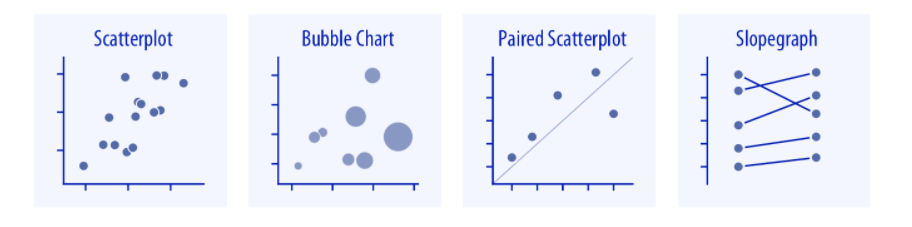
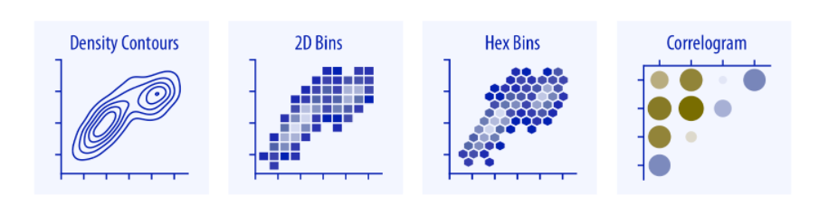
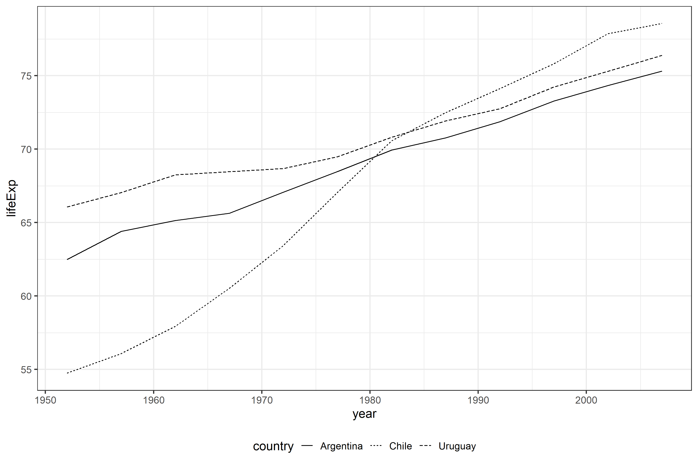
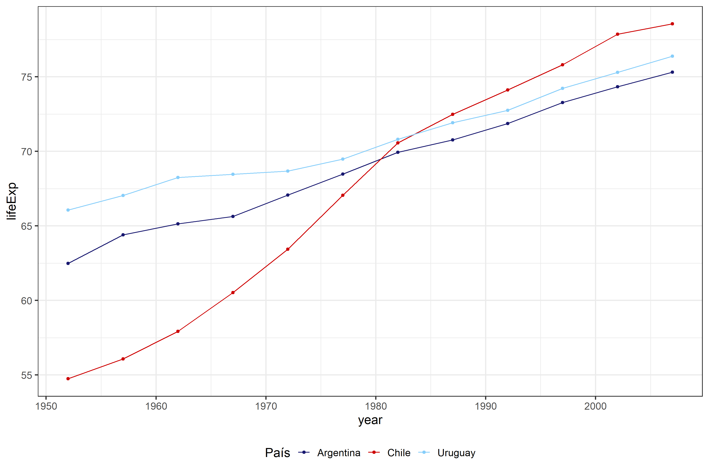

class: inverse, center, middle

```{r setup, include=FALSE}
library(xaringanthemer)
library(kableExtra)
library(xaringan)
library(tidyverse)
library(data.table)
library(gapminder)
library(xaringanExtra)

style_duo_accent(primary_color = "#035AA6",
                 secondary_color = "#507786",
                 text_font_family = "Droid Serif",
                 text_font_url = "https://fonts.googleapis.com/css?family=Droid+Serif:400,700,400italic",
                 header_font_google = google_font("Yanone Kaffeesatz"),
                 text_slide_number_color = "#000000")
knitr::opts_chunk$set(echo = FALSE)
options("kableExtra.html.bsTable" = T)

htmltools::tagList(
  xaringanExtra::use_clipboard(
    button_text = "<i class=\"fa fa-clipboard\"></i>",
    success_text = "<i class=\"fa fa-check\" style=\"color: #90BE6D\"></i>",
    error_text = "<i class=\"fa fa-times-circle\" style=\"color: #F94144\"></i>"
  ),
  rmarkdown::html_dependency_font_awesome()
)
xaringanExtra::use_xaringan_extra(c("tile_view", "animate_css", "tachyons"))
xaringanExtra::use_scribble()
use_extra_styles(
  hover_code_line = TRUE,         
  mute_unhighlighted_code = TRUE
  )  
```

# Principios de la visualización de datos

---

## Introducción

- Las visualizaciones representan datos de forma gráfica a través de líneas, formas, colores, etc.

- La visualización de datos está a mitad de camino entre la ciencia y el arte. Por un lado, los gráficos deben ser una representación exacta de los datos subyacentes, por el otro, una visualización efectiva debe ser estéticamente agradable. Idealmente, logramos alcanzar ambos objetivos. 

- Lo imprescindible es no equivocarse con la parte matemática. En segundo lugar, debemos hacer el esfuerzo para que los gráficos tengan en consideración lo que la ciencia sugiere sobre cómo las personas reaccionan a distintos estímulos y lograr gráficos estéticamente agradables.

- Visualizar los datos de forma gráfica tiene muchos benficios
      - Permite captar de forma rapida patrones que estadísticas descriptivas no permitirían
      - Permite comunicar patrones en los datos de forma rápida y efectiva
      - Permite identificar patrones complejos (relaciones no lineales por ejemplo)

---
## ¿Por qué visualizar?

Cuatro conjuntos de datos:

```{r ch0, echo = FALSE, results = "hide", message = FALSE}
## La data del cuarteto de Anscombe viene en R
anscombe <- datasets::anscombe
## Pasamos a formato tidy
anscombe <- anscombe %>%
  pivot_longer(cols = everything(),
               names_to = c(".value", "set"),
               names_pattern = "(.)(.)") %>% 
  mutate(set = recode(set, "1" = "Conjunto I",
                      "2" = "Conjunto II",
                      "3" = "Conjunto III",
                      "4" = "Conjunto IV"))
print(anscombe)
## Tabla resumen con algunos descriptivos (tienen más en común)
tabla_resumen <- anscombe %>% 
  group_by(set) %>% 
  summarize(n = 11,
            mean_x = round(mean(x), digits = 1),
            mean_y = round(mean(y), digits = 1),
            sd_x = round(sd(x), digits = 1),
            sd_y = round(sd(y), digits = 1))
tabla_resumen
```

```{r ch1, echo = FALSE}
tabla_resumen %>%
  kbl() %>%
  kable_styling(bootstrap_options = c("hover", "condensed"), font_size = 20)
```

---
## ¿Por qué visualizar?

.center[
```{r ch2, echo = FALSE, message = FALSE}
ggplot(data = anscombe, aes(x = x, y = y)) +
  geom_point(size = 4, color = "darkgreen", alpha = .8) +
  geom_smooth(method = "lm", se = FALSE, color = "black") +
  facet_wrap(~ set) +
  theme_bw() +
  labs(title = "Cuartetos de Anscombe")
```
]

---
## Un paseo por los NO

.center[
```{r, out.width = "600px"}

```
]
.right[Nigel Holmes (1982)]

---
## Un paseo por los NO

.center[
```{r, out.width = "600px"}

```
]
.right[Healey (2018)]

---
## Tipos de errores
- Ugly (feo): problemas estéticos pero gráfico claro e informativo
- Bad (malo): problemas relacionados a la percepción: poco claro, confuso
- Wrong (incorrecto): problemas relacionados a la matemática, objetivamente incorrecto

.center[
```{r, out.width = "400px"}
knitr::include_graphics("ima/malas_graficas.png")
```
]
.right[[Wilke (2019)](https://clauswilke.com/dataviz/introduction.html)]

---
## Aesthetics

- Cuando visualizamos datos tomamos valores y los convertimos de forma sistemática y lógica en elementos visuales.

- Los aesthetics (cosas que puedes ver) son características cuantificables que le asignamos a nuestros datos

.center[
```{r, out.width = "500px"}
knitr::include_graphics("ima/aes.png")
```
]
.right[[Wilke (2019)](https://clauswilke.com/dataviz/aesthetic-mapping.html)]


---
## Aesthetics

- Distintos tipos de datos combinan bien con distintos tipos de aesthetics. Por ejemplo, no tiene mucho sentido utilizar formas para una variable contínua o gradientes de color para una variable categórica sin orden.

- Existen muchos estudios como los humanos procesan estímulos visuales. Estos estudios permiten diferenciar qué tan fácil nos es entender los patrones en los datos a partir de estos aesthetics.


---
## Ranking perceptual para datos ordenados

.center[
```{r, out.width = "400px"}

```
]
.right[Schwabish (2021)]

--
## Remarcar datos
.center[
```{r, out.width = "600px"}

```
]
.right[Schwabish (2021)]


---
## Tipos de gráficos

- Debido a que somos mejores identificado posiciones y tamaño, los gráficos de barras, líneas y dispersón son los más comunes.

- Existe una tendencia hacia presentar gráficos de dispersión (maximizar el volumen de información mostrado) y gráficos que resumen modelos estadísticos.

- Los paneles (o facetas) son cada vez más usados (ggplot2 da una enorme ventaja en este sentido)

- [From Data to Viz](https://www.data-to-viz.com/#connectedscatter) es un gran recurso para elegir qué tipo de visualización podemos usar para cadá gráfico y además incluye código de ejemplos en R!

---
## Tipos de gráficos: cantidades

.center[
```{r, out.width = "600px"}

```
]

.center[
```{r, out.width = "600px"}

```
]

.right[Wilke (2019)]


---
## Tipos de gráficos: distribuciones

.center[
```{r, out.width = "600px"}

```
]

.center[
```{r, out.width = "600px"}

```
]

.right[Wilke (2019)]

---
## Tipos de gráficos: proporciones

.center[
```{r, out.width = "500px"}

```
]

.center[
```{r, out.width = "500px"}

```
]

.center[
```{r, out.width = "450px"}

```
]

.right[Wilke (2019)]

---
## Tipos de gráficos: relación x-y

.center[
```{r, out.width = "500px"}

```
]

.center[
```{r, out.width = "500px"}

```
]

.center[
```{r, out.width = "500px"}

```
]

.right[Wilke (2019)]

---
## Tipos de gráficos: geoespacial

.center[
```{r, out.width = "800px"}

```
]

.right[Wilke (2019)]

---
## Tipos de gráficos: incertidumbre

.center[
```{r, out.width = "600px"}

```
]

.center[
```{r, out.width = "600px"}

```
]

.right[Wilke (2019)]

---
## Principios prácticos

- Tres pilares: claridad, precisión y eficiencia

.content-box-blue[*"Un buen gráfico da el lector la mayor cantidad de ideas en el menor tiempo con la menor cantidad de tinta y espacio.*
Edward Tufte
]

- Simplificar! Evitar doble etiquetas, colores innecesarios, etc.

- Graficos reproducibles (no editar a mano al menos que sea imprescindible)

- Entender el tipo de data que estamos gráficando 

- Entender el propósito de cada aesthetics 

---
## Recursos

- [Fundamentals of data visualization: a primer on making informative and compelling
figures](https://clauswilke.com/dataviz/), Wilke (2019). Es un libro (libre, entrar al enlace) sobre los fundamentos teóricos de la visuaización de datos (no incluye código, aunque sus ejemplos son hechos en R)

- [Data visualization a practical introduction](https://socviz.co/), Healey (2018). Este libro combina elementos téoricos y prácticos (código en R!)

- [Better data visualizations: A guide for scholars, researchers and wonks](http://cup.columbia.edu/book/better-data-visualizations/9780231193115). Schwabish (2021). Libro con principios de la visualización de datos.

- [The Visual Display of Quantitative Information](edwardtufte.com/tufte/books_vdqi). Tufte (1983). Libro clásico sobre visualización de datos

- [R for Data Science](https://r4ds.had.co.nz/data-visualisation.html). Wickham y Grolemund (2018). Los capítulos 3 y 28 explican cómo crear visualizaciones con ggplot2

- [The R graph gallery](https://www.r-graph-gallery.com/index.html). Es una colección muy completa de visualizaciones de alta calidad hechas en R (usando distintos paquetes).

---
class: inverse, center, middle

# Gapminder

---

## Gapminder

[Gapminder](https://www.gapminder.org/) es una organización educativa sueca sin fines de lucro que se propone luchar contra percepciones erroneas en economía y salud mediante datos. Existe un paquete de R [Gapminder](https://cran.r-project.org/web/packages/gapminder/README.html) que contiene una base de datos sobre expectativa de vida, población y PBI per capita para muchos países. Es una versión reducida de algunos de los datos utilizados por su fundador Hans Rosling


```{r gap, echo = TRUE, eval=FALSE}
install.packages("gapminder")
```

.codefont[
```{r gap_2, echo = TRUE}
library(gapminder)

glimpse(gapminder)
```
]

---
class: inverse, center, middle

# R Base

---

## Gráficos con R Base

R Base permite crear gráficos como gráficos de barras, histogramas o gráficos de dispersión. Algunas de las funciones para realizar gráficos con R Base son `hist()`, `plot()` o `barplot()`

.center[
```{r, out.width = "400px"}

```
]

---
class: inverse, center, middle

# Intro a ggplot2

---

## ggplot2

- [ggplot2](https://ggplot2.tidyverse.org/) es uno de los paquetes más utilizados de R para visualizar datos debido a su potencia, elegancia y versatilidad.

- No tiene distintas funciones para distintos gráficos (como en el caso de R Base y la mayoría de los softwares) sino que tiene una grámatica de gráficos. Los distintos componentes independientes pueden ser combinados en un mismo gráfico. 

- Tiene muchos argumentos en común para distintos tipos de gráficos

- ggplot funciona con data en formato tidy!

---
## ggplot2

- Funciona en capas que se van sumando con `+`. La primera función siempre es `ggplot()`, donde especificamos la data a usar. Esta función solo crea una gráfica vacía.

- ggplot2 contiene varias funciones con las que se pueden ir creando distintos objetos geométricos (que están asociados a tipos de gráficos pero no son excluyentes). Estas se denominan `geom_()`, por ejemplo para gráficos puntos usamos `geom_point()`, para graficar barras `geom_bar()` o `geom_col()` y para graficar líneas `geom_line`, pero estos se pueden combinar también. 

- [Lista](https://ggplot2.tidyverse.org/reference/)  entera de `geoms`

- Dentro de cada `geom` se definen (o al principio dentro de `ggplot()`) los aesthetics usando `aes()`: `x`, `y`, `color`, `fill`, `shape`, etc.

---

## Especificar la data

.codefont[
```{r ch5, echo = TRUE}
library(gapminder)

d_gap_7 <- gapminder %>% 
  filter(year == 2007)

# Especifico la data a usar
plot <- ggplot(data = d_gap_7)

```
]

.center[
```{r, out.width = "500px"}

```
]

---

## Asignar aesthetics (x, y)
.codefont[
```{r ch6, echo = TRUE}
# Asigno las primeras aesthetics (posición: x e y)
plot <- ggplot(data = d_gap_7, aes(x = gdpPercap, y = lifeExp))

```
]

.center[
```{r, out.width = "600px"}

```
]

---

## Definir primer geom
.codefont[
```{r ch7, echo = TRUE}
# Agrego con + una segunda capa: geom_point para dispersión
plot <- ggplot(data = d_gap_7, aes(x = gdpPercap, y = lifeExp)) +
  geom_point()

```
]

.center[
```{r, out.width = "600px"}

```
]

---

## Settings de un geom  
.codefont[
```{r ch8, echo = TRUE}
# Asigno atributos de geom_point: color, size, shape
plot <- ggplot(data = d_gap_7, aes(x = gdpPercap, y = lifeExp)) +
  geom_point(color = "black", fill = "skyblue3", size = 3, shape = 21)

```
]

.center[
```{r, out.width = "600px"}

```
]


---
## Mapping vs setting

- La función `aes()` no solo sirve para asignar posición `(x,y)` sino que también para [otras aesthetics](https://ggplot2.tidyverse.org/reference/aes.html) como tamaño, color, tipo de línea, etc. Sin embargo, cuando definimos esto dentro de `aes()` no nos referimos al color o al tipo de forma específico sino que a la variable por la que agrupamos esas aesthetics. Si específicamos `fill = continent` estamos diciendo que los colores representarán la variable continente. Después podemos especificar el color o la forma para cada grupo. A esto se le llama mapping  (asignar según una variable) 

- .bold[Importante:] si definimos un setting (valor fijo) dentro de `aes()` no funcionará bien. Cuando queremos definir un setting (por ej. `color = "red"` lo hacemos fuera del `aes()`). 

- Dentro del `geom()` podemos especificar los "settings": colores o formas específicas. O con otras funciones como `scale_color_brewer()`

- Por ejemplo, supongamos que queremos crear un gráfico de dispersión donde el tamaño de los puntos refleje el tamaño de población y definir el color rojo para todos ellos:

.codefont[
```{r ch8b, echo = TRUE, eval = FALSE}
ggplot(data = d_gap_7, aes(x = gdpPercap, y = lifeExp)) +
  geom_point(aes(size = pop), color = "red")

```
]

---

## Aesthetics por grupo
.codefont[
```{r ch9, echo = TRUE}
# Asigno color según una variable que agrupa (siempre dentro de aes()!)
plot <- ggplot(data = d_gap_7,
               aes(x = gdpPercap, y = lifeExp, fill = continent)) +
  geom_point(size = 3, shape = 21) 

```
]

.center[
```{r, out.width = "600px"}

```
]


---

## Otro geom (línea de tendencia)
.codefont[
```{r ch11, echo = TRUE, warning = FALSE}
# También puedo crear la línea de tendencia por grupo!
plot <- ggplot(data = d_gap_7, 
               aes(x = gdpPercap, y = lifeExp, fill = continent, color = continent)) +
  geom_point(size = 3, shape = 21) +
  geom_smooth(method = "lm", se = FALSE)

```
]

.center[
```{r, out.width = "600px"}

```
]

---

## Cambio escala de x
.codefont[
```{r ch12, echo = TRUE, warning = FALSE}
# Cambio de escala Probar también xlim()
plot <- ggplot(data = d_gap_7, 
               aes(x = gdpPercap, y = lifeExp)) +
  geom_point(size = 3, alpha = 0.3, color = "skyblue3") +
  geom_smooth(method = "lm", se = FALSE) +
  scale_x_log10() 
```
]

.center[
```{r, out.width = "600px"}

```
]


---

## Dividir en facetas
.codefont[
```{r ch13, echo = TRUE, warning = FALSE, message=FALSE}
# Dividimos en facetas por continente (quitando Oceanía)
plot <- plot +
  facet_wrap(~ continent)
```
]

.center[
```{r, out.width = "550px"}

```
]

---

## Quitamos etiqueta duplicada
.codefont[
```{r ch13b, echo = TRUE, warning = FALSE, message=FALSE}
# Quitamos etiqueta duplicada
plot <- plot +
  theme(legend.position = "none")
```
]

.center[
```{r, out.width = "550px"}

```
]


---

## Quitamos colores 
.codefont[
```{r ch13c, echo = TRUE, warning = FALSE, message=FALSE}
# Quitamos colores innecesarios
plot <- ggplot(data = d_gap_7 %>% 
         filter(continent != "Oceania"), 
       aes(x = gdpPercap, y = lifeExp)) +
  geom_point(size = 3, shape = 21,  alpha = .7, fill = "skyblue") +
  geom_smooth(method = "lm", se = FALSE, color = "navyblue")
```
]

.center[
```{r, out.width = "550px"}

```
]

---

## Agregamos una cuarta variable!
.codefontchico[
```{r ch14, echo = TRUE, warning = FALSE, message=FALSE, eval = FALSE}
ggplot(data = d_gap_7 %>% 
         filter(continent != "Oceania"), 
       aes(x = gdpPercap, y = lifeExp)) +
  geom_point(aes(size = pop), shape = 21,  alpha = .7, fill = "skyblue") +
  geom_smooth(method = "lm", se = FALSE, color = "navyblue") +
  scale_x_log10() 
  facet_wrap(~ continent) 
```
]

.center[
```{r, out.width = "550px"}

```
]

---

## Manipular datos para mejor visualización
.codefontchico[
```{r ch15, echo = TRUE, warning = FALSE, message=FALSE, eval = FALSE}
ggplot(data = d_gap_7 %>% filter(continent != "Oceania") %>% 
         mutate(pop_mil = pop / 1000000), 
       aes(x = gdpPercap, y = lifeExp)) +
  geom_point(aes(size = pop_mil), shape = 21,  alpha = .7, fill = "skyblue") +
  geom_smooth(method = "lm", se = FALSE, color = "navyblue") +
  scale_x_log10() +
  facet_wrap(~ continent) +
  theme(legend.position = "bottom") +
  scale_size_continuous(name = "Población (en millones)")
```
]

.center[
```{r, out.width = "550px"}

```
]

---

## Estética
.codefontchico[
```{r ch16, echo = TRUE, warning = FALSE, message=FALSE, eval = FALSE}
plot +
  labs(title = "PBI per cápita y expectativa de vida",
       subtitle = "Data de 2017",
       caption = "Fuente: Gapminder",
       x = "PBI per cápita",
       y = "Expectativa de vida") +
  theme_bw()
  
```
]

.center[
```{r, out.width = "600px"}

```
]

---
## Ejercicio

.content-box-blue[
*Cargar la base nba_data y crear dos gráficos:* 

*(1) un histograma (con R base) de los puntos convertidos por los equipos locales en todos los partidos de la base* 

*(2) un gráfico de dispersión con la relación entre puntos convertidos por el local y puntos convertidos por el visitante  *
]


---
class: inverse, center, middle

# Aesthetics

---
## Formas

.center[
```{r, out.width = "600px"}

```
]

Hay formas duplicadas porque tienen distintas maneras de colorearse. De 0 a 14 las formas se pintan con `color` y se pinta solo el borde. De 15 a 20 se pinta con `color` también pero se rellena la forma y de 20 a 24 pintamos el borde con `color` y el relleno con `fill`

---
## Formas: definir una forma

.codefont[
```{r ch18, echo = TRUE, warning = FALSE, message=FALSE, eval = FALSE}
## Definir forma específica
ggplot(d_gap_7, aes(x = gdpPercap, y = lifeExp)) +
  geom_point(shape = 9)
```
]

.center[
```{r, out.width = "600px"}

```
]

---
## Formas: asignar forma según variable

.codefont[
```{r ch19, echo = TRUE, warning = FALSE, message=FALSE, eval = FALSE}
## Asignar forma según continente (ggplot elige por defecto formas)
ggplot(d_gap_7, 
       aes(x = gdpPercap, y = lifeExp, shape = continent)) +
  geom_point() +
  theme(legend.position = "bottom")
```
]

.center[
```{r, out.width = "600px"}

```
]

---
## Formas: definir forma para cada valor de variable

.codefont[
```{r ch20, echo = TRUE, warning = FALSE, message=FALSE, eval = FALSE}
## Definir manualmente la forma para cada continente
ggplot(d_gap_7, 
       aes(x = gdpPercap, y = lifeExp, shape = continent)) +
  geom_point() +
  theme(legend.position = "bottom") +
  scale_shape_manual(name = "Continente",
                     values = c(15, 16, 17, 18, 19))
```
]

.center[
```{r, out.width = "500px"}

```
]

---
## Formas: definir forma para cada valor de variable

.codefontchico[
```{r ch21, echo = TRUE, warning = FALSE, message=FALSE, eval = FALSE}
## Definir manualmente la forma para cada continente (otra forma)
ggplot(d_gap_7, 
       aes(x = gdpPercap, y = lifeExp, shape = continent)) +
  geom_point() +
  theme(legend.position = "bottom") +
  scale_shape_manual(name = "Continente",
                     values = c("Europe" = 3,
                                "Oceania" = 8, 
                                "Africa" = 12, 
                                "Asia" = 18, 
                                "Americas" = 22))
```
]

.center[
```{r, out.width = "500px"}

```
]

---
## Tipos de línea

.center[
```{r, out.width = "600px"}

```
]

Las llamamos por su nombre:

```{r ch16bb, echo = TRUE, warning = FALSE, message=FALSE, eval = FALSE}
ggplot(data = data, x = variable1, y = variable2) +
  geom_line(linetype = "dashed", color="red", size=2)
```
---
## Tipos de línea: según variable

.codefontchico[
```{r ch22, echo = TRUE, warning = FALSE, message=FALSE, eval = FALSE}
## Lineas por variable
ggplot(conosur, aes(x = year, y = lifeExp)) +
  geom_line(aes(linetype = country)) +
  theme(legend.position = "bottom")
```
]

.center[
```{r, out.width = "600px"}

```
]

---
## Tipos de línea: definir tipo de linea para cada país

.codefontchico[
```{r ch23, echo = TRUE, warning = FALSE, message=FALSE, eval = FALSE}
## Definir tipo de linea por país
plot <- ggplot(conosur, aes(x = year, y = lifeExp)) +
  geom_line(aes(linetype = country)) +
  theme(legend.position = "bottom") +
  scale_linetype_manual(name = "País",
                        values = c("Argentina" = "dotted",
                                   "Chile" = "dashed",
                                   "Uruguay" = "solid"))
```
]

.center[
```{r, out.width = "600px"}

```
]

---
## Tipos de línea: definir tipo de línea para cada país

.codefontchico[
```{r ch24, echo = TRUE, warning = FALSE, message=FALSE, eval = FALSE}
## Definir tipo de linea por país
plot +
  geom_point(aes(shape = country)) +
  labs(linetype = "País", shape = "País")
```
]

.center[
```{r, out.width = "600px"}

```
]

---
## Colores

R tiene muchos colores definidos, además de que permite utilizar [hexcolors](https://htmlcolorcodes.com/es/). Con  `colors()` pueden ver una lista con ellos. Pueden consultar otra lista ampliada de colores [acá](http://www.stat.columbia.edu/~tzheng/files/Rcolor.pdf?utm_source=twitterfeed&utm_medium=twitter). [R graph gallery](https://www.r-graph-gallery.com/ggplot2-color.html) tiene una sección para aplicar distintos colores fácilmente. Algunos de los colores predeterminados (podemos llamarlos por su nombre, siempre entre paréntesis):

.center[
```{r, out.width = "500px"}

```
]

---
## Paletas de colores

En muchas visualizaciones no utilizamos un solo color sino que conjuntos de colores, o paletas. Distintas paletas sirven para distintos tipos de datos. El paquete [RColorBrewer](https://www.r-graph-gallery.com/38-rcolorbrewers-palettes.html) contiene las paletas más utilizadas. Hay tres tipos de paletas: 

- Secuenciales: para data ordenada (van de colores más claros a oscuros, dentro de una misma tonalidad)

- Divergentes: para data ordenada (los colores claros están en el medio y hacia los extremos toman tonalidades divergentes)

- Cualitativas: para data no ordenada, simplemente distintos colores que se asignan a distintas clases, sin orden.

A su vez, el paquete [viridis](https://cran.r-project.org/web/packages/viridis/vignettes/intro-to-viridis.html) tiene paletas continuas y discretas con combinaciones de colores que permiten resaltar datos distintos, que no causan problemas en personas con daltonismo y que se imprimen bien en escala de grises.

Ambos paquetes se integran muy bien con ggplot a través de distintas funciones como `scale_color_brewer()` o `scale_color_viridis()`
---
## Paletas de colores

.center[
```{r, out.width = "600px"}

```
]

---
## Colores: por variable

.codefontchico[
```{r ch25, echo = TRUE, warning = FALSE, message=FALSE, eval = FALSE}
## Color por país (ggplot elige automático)
ggplot(conosur, aes(x = year, y = lifeExp, color = country)) +
  geom_line() +
  geom_point() +
  theme(legend.position = "bottom")
```
]

.center[
```{r, out.width = "600px"}

```
]

---
## Colores: asignar colores manualmente

.codefontchico[
```{r ch26, echo = TRUE, warning = FALSE, message=FALSE, eval = FALSE}
## Color por país (asigno colores manualmente)
ggplot(conosur, aes(x = year, y = lifeExp, color = country)) +
  geom_line() +
  geom_point() +
  theme(legend.position = "bottom") +
  scale_color_manual(name = "País",
                     values = c("midnightblue", "red3", "lightskyblue"))
```
]

.center[
```{r, out.width = "600px"}

```
]


---
## Colores: detalles estéticos

.codefontchico[
```{r ch27, echo = TRUE, warning = FALSE, message=FALSE, eval = FALSE}
## Color por país (otros detalles estéticos)
ggplot(conosur, aes(x = year, y = lifeExp, color = country)) +
  geom_line(size = 1.5, alpha = 0.4) +
  geom_point(size = 3) +
  theme(legend.position = "bottom") +
  scale_color_manual(name = "País",
                     values = c("midnightblue", "red3", "lightskyblue"))
```
]

.center[
```{r, out.width = "600px"}

```
]

---
## Colores: asignar colores con paleta de RColorBrewer

.codefontchico[
```{r ch28, echo = TRUE, warning = FALSE, message=FALSE, eval = FALSE}
## Color por país (usando paletas de RColorBrewer: elegir una discreta para este caso)
ggplot(conosur, aes(x = year, y = lifeExp, color = country)) +
  geom_line(size = 1.5, alpha = 0.4) +
  geom_point(size = 3) +
  theme(legend.position = "bottom") +
  scale_color_brewer(palette = "Dark2")
```
]

.center[
```{r, out.width = "600px"}

```
]

---
## Colores: paletas continuas

.codefontchico[
```{r ch29, echo = TRUE, warning = FALSE, message=FALSE, eval = FALSE}
## Color con paleta continua con paquete viridis 
ggplot(d_gap_7, aes(x = pop, y = gdpPercap, color = lifeExp)) +
  geom_point(size = 3) +
  scale_x_log10() +
  scale_color_viridis(name = "Expectativa de vida") +
  theme(legend.position = "bottom") 
```
]

.center[
```{r, out.width = "600px"}

```
]

---
## Colores: paletas continuas

.codefontchico[
```{r ch30, echo = TRUE, warning = FALSE, message=FALSE, eval = FALSE}
## Color con paleta continua especificando valores
ggplot(d_gap_7, aes(x = pop, y = gdpPercap, color = lifeExp)) +
  geom_point(size = 3) +
  scale_x_log10() +
  scale_color_gradient(name = "Expectativa de vida", low = "red", high = "Blue") +
  theme(legend.position = "bottom") 
```
]

.center[
```{r, out.width = "600px"}

```
]

---
class: inverse, center, middle

# Tipos de geoms

---
## geom_bar()

- ggplot2 cuenta con dos geoms para hacer gráficos de barras `geom_bar()` y `geom_col()`

-  Cuando usamos `geom_bar()`  tenemos que tener en cuenta dos argumentos clave: `stat` (nivel de agregación de la variable: count, proporción, etc.) y `position` (posición en la que se desplegan las categorías: apiladas, separadas, etc.)

- Por defecto  `geom_bar()` grafica la cantidad de observaciones de cada valor de `x` (no necesita argumento `y`). Sin embargo, si ya tenemos una tabla resumida podemos ajustarlo con `stat = identity`, especificando un valor `y` o usando `geom_col()`

---
## geom_bar()

.codefontchico[
```{r ch31, echo = TRUE, warning = FALSE, message=FALSE, eval = FALSE}
table(d_gap_7$continent) # solo data de 2007 (gapminder)
## Graficar cuántos países hay por continente en nuestra base
ggplot(data = d_gap_7, aes(x = continent)) +
  geom_bar()

```
]

.center[
```{r, out.width = "600px"}

```
]

---
## geom_bar(): 

Por defecto no funciona con datos resumidos 

.codefontchico[
```{r ch32, echo = TRUE, warning = FALSE, message=FALSE, eval = FALSE}
## Con datos resumidos
data_resumen <- d_gap_7 %>% 
  group_by(continent) %>% 
  summarize(n = n())
ggplot(data_resumen, aes(x = continent)) +
  geom_bar()
```
]

.center[
```{r, out.width = "500px"}

```
]

---
## geom_col(): 

Para eso podemos usar `geom_col()`, especificando cuál es la columna con el valor con el argumento `y`

.codefontchico[
```{r ch32b, echo = TRUE, warning = FALSE, message=FALSE, eval = FALSE}
## Con datos resumidos
data_resumen <- d_gap_7 %>% 
  group_by(continent) %>% 
  summarize(n = n())

ggplot(data_resumen, aes(x = continent, y = n)) +
  geom_col()
```
]

.center[
```{r, out.width = "500px"}

```
]

---
## geom_bar(): con datos resumidos

.codefontchico[
```{r ch33, echo = TRUE, warning = FALSE, message=FALSE, eval = FALSE}
# Especificamos el argumento stat = identity para trabajar con datos resumidos
ggplot(data_resumen, aes(x = continent, y = n)) +
  geom_bar(stat = "identity")
```
]

.center[
```{r, out.width = "600px"}

```
]

---
## geom_bar(): proporciones

.codefontchico[
```{r ch34, echo = TRUE, warning = FALSE, message=FALSE, eval = FALSE}
ggplot(d_gap_7, aes(x = continent)) +
  geom_bar(aes(y = ..prop.., group = 1))
```
]

.center[
```{r, out.width = "600px"}

```
]

---
## geom_bar(): barras por variable

.codefontchico[
```{r ch35, echo = TRUE, warning = FALSE, message=FALSE, eval = FALSE}
data75 <- d_gap_7 %>% 
  mutate(esp = case_when(lifeExp > 75 ~ 1,
                         TRUE ~ 0)) %>% 
  group_by(continent, esp) %>% 
  summarize(n = n())

ggplot(data75, aes(x = continent, y = n, fill = as.factor(esp))) +
  geom_bar(stat = "identity", position = "stack") # posicion por defecto
```
]

.center[
```{r, out.width = "600px"}

```
]

---
## geom_bar(): barras agrupadas

.codefontchico[
```{r ch36, echo = TRUE, warning = FALSE, message=FALSE, eval = FALSE}
## Podemos jugar con la posición: 
# Barras agrupadas
ggplot(data75, aes(x = continent, y = n, fill = as.factor(esp))) +
  geom_bar(stat = "identity", position = "dodge")
```
]

.center[
```{r, out.width = "600px"}

```
]

---
## geom_bar(): barras apiladas por proporción

.codefontchico[
```{r ch37, echo = TRUE, warning = FALSE, message=FALSE, eval = FALSE}
# Barras proporción
ggplot(data75, aes(x = continent, y = n, fill = as.factor(esp))) +
  geom_bar(stat = "identity", position = "fill")
```
]

.center[
```{r, out.width = "600px"}

```
]

---
## geom_bar(): estética

.codefontchico[
```{r ch38, echo = TRUE, warning = FALSE, message=FALSE, eval = FALSE}
ggplot(data = d_gap_7, aes(x = continent)) +
  geom_bar(color = "black", fill = "skyblue3", alpha = .8) +
  labs(title = "Cantidad de países por continente",
       subtitle = "Data de Gapminder para el año 2007",
       caption = "Fuente: Gapminder",
       x = "", y = "")
```
]

.center[
```{r, out.width = "600px"}

```
]
---
## geom_bar(): girar

.codefontchico[
```{r ch39, echo = TRUE, warning = FALSE, message=FALSE, eval = FALSE}
ggplot(data = d_gap_7, aes(x = continent)) +
  geom_bar(color = "black", fill = "skyblue3", alpha = .8) +
  labs(title = "Cantidad de países por continente",
       subtitle = "Data de Gapminder para el año 2007",
       caption = "Fuente: Gapminder",
       x = "", y = "") +
  cord_flip()
```
]

.center[
```{r, out.width = "500px"}

```
]

---
## geom_bar(): ordenar categorías manualmente

.codefontchico[
```{r ch40, echo = TRUE, warning = FALSE, message=FALSE, eval = FALSE}
positions <- c("Americas", "Europe", "Africa", "Oceania", "Asia")

ggplot(data = d_gap_7, aes(x = continent)) +
  geom_bar(color = "black", fill = "skyblue3", alpha = .8) +
  labs(title = "Cantidad de países por continente",
       subtitle = "Data de Gapminder para el año 2007",
       caption = "Fuente: Gapminder",
       x = "", y = "") +
  scale_x_discrete(limits = positions)

```
]

.center[
```{r, out.width = "500px"}

```
]

---
## geom_bar(): ordenar categorías según frecuencia

.codefontchico[
```{r ch41, echo = TRUE, warning = FALSE, message=FALSE, eval = FALSE}
ggplot(data = d_gap_7, aes(x = fct_infreq(continent))) +
  geom_bar(color = "black", fill = "skyblue3", alpha = .8) +
  labs(title = "Cantidad de países por continente",
       subtitle = "Data de Gapminder para el año 2007",
       caption = "Fuente: Gapminder",
       x = "", y = "")
```
]

.center[
```{r, out.width = "600px"}

```
]

---
## geom_text()

Permite incluir texto en los gráficos, ver también `annotate()` y `geom_label()`. Como cualquier geom, se puede utilizar solo o combinado. Supongamos que queremos agregar etiquetas al siguiente gráfico:

.codefontchico[
```{r ch42, echo = TRUE, warning = FALSE, message=FALSE, eval = FALSE}
lista_a_sur <- c("Argentina", "Brazil", "Bolivia", "Chile", "Colombia", 
                 "Ecuador", "Paraguay", "Peru", "Uruguay", "Venezuela")

a_sur <- gapminder %>% 
  filter(year == 2007 & country %in% lista_a_sur)

## Gráfico de dispersión expectativa de vida y pbi per cápita
ggplot(a_sur, aes(x = gdpPercap, y = lifeExp)) +
  geom_point()
```
]

.center[
```{r, out.width = "400px"}

```
]

---
## geom_text()

.codefontchico[
```{r ch43, echo = TRUE, warning = FALSE, message=FALSE, eval = FALSE}
# Agregar etiquetas
ggplot(a_sur, aes(x = gdpPercap, y = lifeExp)) +
  geom_point() +
  geom_text(aes(label = country))
```
]

.center[
```{r, out.width = "600px"}

```
]

---
## geom_text(): posición 

.codefontchico[
```{r ch44, echo = TRUE, warning = FALSE, message=FALSE, eval = FALSE}
# Podemos ajustar la posición de las etiquetas
ggplot(a_sur, aes(x = gdpPercap, y = lifeExp)) +
  geom_point() +
  geom_text(aes(label = country), hjust = 0.5, vjust = -1)
```
]

.center[
```{r, out.width = "600px"}

```
]

---
## geom_text(): solo texto

.codefontchico[
```{r ch45, echo = TRUE, warning = FALSE, message=FALSE, eval = FALSE}
# Podemos también dejar solo el texto
ggplot(a_sur, aes(x = gdpPercap, y = lifeExp)) +
  geom_text(aes(label = country))
```
]

.center[
```{r, out.width = "600px"}

```
]

---
## geom_text(): etiquetas en otros gráficos

.codefontchico[
```{r ch46, echo = TRUE, warning = FALSE, message=FALSE, eval = FALSE}
ggplot(data = d_gap_7, aes(x = fct_infreq(continent))) +
  geom_bar(color = "black", fill = "skyblue3", alpha = .8) +
  geom_text(aes(label = ..count..), stat = "count", vjust = -.5, fontface = "bold") +
  labs(title = "Cantidad de países por continente",
       subtitle = "Data de Gapminder para el año 2007",
       caption = "Fuente: Gapminder",
       x = "",
       y = "") 
```
]

.center[
```{r, out.width = "600px"}

```
]

---
## anotate(): texto en gráfico

.codefontchico[
```{r ch47, echo = TRUE, warning = FALSE, message=FALSE, eval = FALSE}
ggplot(data = d_gap_7, aes(x = fct_infreq(continent))) +
  geom_bar(color = "black", fill = "skyblue3", alpha = .8) +
  geom_text(aes(label = ..count..), stat = "count", vjust = -.5, fontface = "bold") +
  labs(title = "Cantidad de países por continente",
       subtitle = "Data de Gapminder para el año 2007",
       caption = "Fuente: Gapminder",
       x = "",
       y = "") +
    annotate("text", x = "Oceania", y = 10, label = "Que pocos países \n hay en Oceanía")
```
]

.center[
```{r, out.width = "600px"}

```
]

---
## geom_boxplot()

.codefontchico[
```{r ch48, echo = TRUE, warning = FALSE, message=FALSE, eval = FALSE}
## Boxplot tradicional
d_gap_7 %>%
  filter(continent != "Oceania") %>% 
  ggplot(aes(x = continent, y = gdpPercap)) +
  geom_boxplot() +
```
]

.center[
```{r, out.width = "600px"}

```
]


---
## geom_boxplot() y geom_jitter()

.codefontchico[
```{r ch49, echo = TRUE, warning = FALSE, message=FALSE, eval = FALSE}
# Boxplot con todos los puntos con geom_jitter()
d_gap_7 %>%
  filter(continent != "Oceania") %>% 
  ggplot(aes(x = continent, y = gdpPercap)) +
  geom_boxplot(aes(fill = continent), outlier.shape = NA, lwd=1, alpha=0.4) +
  geom_jitter(aes(color = continent), size = 4, alpha = 0.9) +
  scale_color_brewer(palette = "Dark2") +
  scale_fill_brewer(palette = "Dark2") +
  theme(legend.position = "none")
```
]

.center[
```{r, out.width = "500px"}

```
]

---

## geom_density()

.codefontchico[
```{r ch50, echo = TRUE, warning = FALSE, message=FALSE, eval = FALSE}
## Distribución del PBI per cápita en 2007
ggplot(d_gap_7, aes(x = gdpPercap)) +
  geom_density() 

```
]

.center[
```{r, out.width = "600px"}

```
]

---

## geom_density()

.codefontchico[
```{r ch51, echo = TRUE, warning = FALSE, message=FALSE, eval = FALSE}
# Agregamos colores
ggplot(d_gap_7, aes(x = gdpPercap)) +
  geom_density(fill = "seagreen3", alpha = .7) 
```
]

.center[
```{r, out.width = "600px"}

```
]


---
  
## geom_density()
  
.codefontchico[
```{r ch52, echo = TRUE, warning = FALSE, message=FALSE, eval = FALSE}
# Desagregar por continente
d_gap_7 %>%
  filter(continent != "Oceania") %>%
  ggplot(aes(x = gdpPercap, fill = continent)) +
  geom_density( alpha = .7, adjust = 1.5) +
  scale_fill_brewer(palette = "Accent") +
  facet_wrap(~ continent)
```
]

.center[
```{r, out.width = "500px"}

```
]

---
  
---
## ggridges
  
.pull-left[
.codefontchico[
```{r ch53, echo = TRUE, warning = FALSE, message=FALSE, eval = FALSE}
# Densidades segun variable en el mismo eje
library(ggridges)
ggplot(gapminder, 
       aes(x = lifeExp, y = as.factor(year))) + 
    geom_density_ridges(fill = "lightblue") +
    labs(title = "Distribución de expectativa de vida por año",
       caption = "Data: Gapminder",
       x = "", y = "")
```
]
]

.pull-right[
.center[
```{r, out.width = "400px"}

```
]
]

---
## ggridges
  

.codefontchico[
```{r ch54, echo = TRUE, warning = FALSE, message=FALSE, eval = FALSE}
# Agrego facetas
gapminder %>%
  filter(continent == "Africa" | continent == "Europe") %>% 
  ggplot(aes(x = lifeExp, y = as.factor(year))) + 
  geom_density_ridges(fill = "lightblue") +
  facet_wrap(~ continent, nrow = 1) +
    labs(title = "Distribución de expectativa de vida por año en Africa y Europa",
       caption = "Data: Gapminder",
       x = "", y = "")
```
]

.center[
```{r, out.width = "400px"}

```
]

---

## ggridges
  
.pull-left[
.codefontchico[
```{r ch55, echo = TRUE, warning = FALSE, message=FALSE, eval = FALSE}
# Densidades en el mismo eje
# Agrego la media con quantiles_ines y quantiles_fun!
gapminder %>% 
  filter(continent == "Africa" |
           continent == "Asia") %>% 
  ggplot(aes(x = lifeExp, 
             y = as.factor(year),
             fill = continent)) + 
  geom_density_ridges(alpha = .6) +
  scale_fill_manual(name = "Continente",
                    values = c("red3", 
                               "lightblue")) +
    labs(title = "Distribución de expectativa de vida por año en África y Asia",
       caption = "Data: Gapminder",
       x = "", y = "") 
    ```
]
]

.pull-right[
.center[
```{r, out.width = "400px"}

```
]
]
---

class: inverse, center, middle

# Gráficos animados

---

## Gráficos animados

Con el paquete gganimate podemos crear graficos animados y luego exportarlos como `.gifs`. Supongamos que queremos mostrar la evolución de la expectativa de vda y del PBI per cápita por país usando los datos de Gapminder

.pull-left[
.codefontchico[
```{r ani_1, echo = TRUE, warning = FALSE, message=FALSE, eval=FALSE}
d_gap <- (gapminder)

# Primero podríamos crear un gráfico tradicional 
p_static <- ggplot(d_gap, aes(x = gdpPercap, y = lifeExp, colour = continent)) +
  geom_point(aes(size = pop), alpha = 0.7) +
  scale_size(range = c(2, 12)) +
  scale_color_brewer(palette = "Dark2") +
  scale_x_log10() + guides(size = FALSE) +
  labs(x = "PBI per capita", y = "Expectativa de vida") +
  theme(legend.position = "bottom") 
p_static
```
]
]

.pull-right[
.center[
```{r, out.width = "400px"}

```
]
]
---
## Gráficos animados


```{r ani_2, echo = TRUE, warning = FALSE, message=FALSE, eval=FALSE}
p_static_facet <- p_static +
  facet_wrap(~ year)
```

.center[
```{r, out.width = "350px"}

```
]

---
## Gráficos animados

```{r ani_2B, echo = TRUE, warning = FALSE, message=FALSE, eval=FALSE}

p_ani <- p_static + 
  transition_time(year) +
  labs(title = "Año: {frame_time}")
```

.center[
```{r, out.width = "450px"}

```
]

---
## Gráficos animados

```{r ani_3, echo = TRUE, warning = FALSE, message=FALSE, eval=FALSE}
p_ani_2 <- p_ani + 
  shadow_wake(wake_length = 0.1, alpha = FALSE) # Agregamos sombra
```

.center[
```{r, out.width = "500px"}

```
]

---
## Gráficos animados

.codefontchico[
```{r ani_4, echo = TRUE, warning = FALSE, message=FALSE, eval=FALSE}
# Identificamos países por color
d_gap <- gapminder %>% 
  mutate(etiqueta = case_when(
    country == "Argentina" ~ "Argentina",
    country == "Uruguay" ~ "Uruguay",
    country == "Chile" ~ "Chile",
    country == "Brazil" ~ "Brazil",
    country == "Costa Rica" ~ "Costa Rica",
    country == "Colombia" ~ "Colombia",
    country == "Italy" ~ "Italy",
    country == "Spain" ~ "Spain",
    TRUE ~ "Otros países"
  ))
p_static_2 <- ggplot(d_gap, 
                   aes(x = gdpPercap, y = lifeExp, colour = etiqueta)) +
  geom_point(aes(size = pop), alpha = 0.7) +
  scale_size(range = c(2, 12)) +
  scale_x_log10() +
  guides(size = FALSE) +
  labs(x = "PBI per capita", y = "Expectativa de vida") +
  theme(legend.position = "bottom") +
  scale_color_manual(name = "País",
                     values = c("Argentina" = "dodgerblue3",
                                "Uruguay" = "skyblue",
                                "Chile" = "brown1",
                                "Brazil" = "chartreuse4",
                                "Costa Rica" = "brown4",
                                "Colombia" = "gold2",
                                "Italy" = "palegreen2",
                                "Spain" = "goldenrod4", 
                                "Otros países" = adjustcolor("gray72", alpha.f = .5)))
```
]


---
## Gráficos animados

.codefont[
```{r ani_5, echo = TRUE, warning = FALSE, message=FALSE, eval=FALSE}
p_ani_3 <- p_static_2 + 
  transition_time(year) +
  labs(title = "Año: {frame_time}") +
  shadow_mark(alpha = 0.3, size = 0.5)
```
]

.center[
```{r, out.width = "400px"}

```
]

---
class: inverse, center, middle

# Estadística inferencial y visualización

---

## OPUY

[opuy](https://github.com/Nicolas-Schmidt/opuy) es un paquete que cuenta con data de aprobación del presidente en Uruguay. La data de opuy también está en la carpeta data. 

.codefont[
```{r ch56c, echo = TRUE, warning = FALSE, message=FALSE}
library(opuy)

data <- opuy %>% 
  filter(medicion == "Evaluacion de gestion presidente",
         categoria == "Aprueba") %>% 
  select(fecha, empresa, presidente, valor) %>% 
  rename(aprobacion = valor) %>% 
  arrange(fecha)

data
```
]

---
## Intervalos de confianza con geom_errorbar()
  
R tiene muchas funciones para realizar estadística inferencial. En el caso de los intervalos de confianza -entre otras opciones- podemos calcularlos manualmente o con la función `summarySE()` del paquete Rmisc. 


.codefont[
```{r ch562, echo = TRUE, warning = FALSE, message=FALSE}
## Defino valor crítico con qnorm()
valor_critico <- qnorm(0.975)
  
# Calcular manualmente
data_resumen <- data %>% 
  group_by(presidente) %>% 
  summarize(
    mean = mean(aprobacion),
    sd = sd(aprobacion),
    ci = valor_critico * (sd(aprobacion) / sqrt(n())),
    ci_low =  mean(aprobacion) - valor_critico * (sd(aprobacion) / sqrt(n())),
    ci_up =  mean(aprobacion) + valor_critico * (sd(aprobacion) / sqrt(n()))
    )

data_resumen
```
]

---
## Graficar intervalos de confianza

Para graficar intervalos de confianza primero debemos calcularlos. Podemos utilizar funciones (ej. `summarySE()` de Rmisc) o calcularlos de forma manual. 

.codefont[
```{r ch56b, echo = TRUE, warning = FALSE, message=FALSE}
# Con summarySE() de Rmisc
data_resumen_2 <- Rmisc::summarySE(data,
                                   measurevar = "aprobacion",
                                   conf.interval = 0.95,
                                   na.rm = TRUE,
                                   groupvars = "presidente") 
data_resumen_2

```
]

---
## Intervalos de confianza con geom_errorbar()
  
.codefontchico[
```{r ch57, echo = TRUE, warning = FALSE, message=FALSE, eval = FALSE}
# Grafico resultados con ggplot2
ggplot(data_resumen, aes(x = fct_reorder(presidente, -mean), y = mean)) +
  geom_errorbar(aes(ymin = ci_low, ymax = ci_up), colour="black", width=.1) +
  geom_point(size=3) +
  labs(title = "Aprobación de presidente por administración",
       caption = "Fuente: OPUY",
       x = "",
       y = "") 
```
]

.center[
```{r, out.width = "500px"}
knitr::include_graphics("resultados/plots/plot52.png")
```
]

---
## Gráficos con desvío estandar con geom_errorbar()
  
.codefontchico[
```{r ch57_2, echo = TRUE, warning = FALSE, message=FALSE, eval = FALSE}
# Grafico resultados con ggplot2
ggplot(data_resumen, aes(x = fct_reorder(presidente, -mean), y = mean)) +
  geom_errorbar(aes(ymin = mean - sd, ymax = mean + sd), colour="black", width=.1) +
  geom_point(size=3) +
  labs(title = "Aprobación de presidente por administración",
       caption = "Fuente: OPUY",
       x = "",
       y = "") 
```
]

.center[
```{r, out.width = "500px"}

```
]

---
## Intervalos de confianza con geom_errorbar()
  
.pull-left[
.codefontchico[
```{r ch58, echo = TRUE, warning = FALSE, message=FALSE, eval = FALSE}
# Grafico resultados con ggplot2
# Intervalo de confianza con barras
ggplot(data_resumen, 
       aes(x = fct_reorder(presidente, -mean),
           y = mean)) + 
  geom_bar(aes(fill = presidente), 
           stat = "identity", alpha = .75, 
           color = "black") +
  geom_errorbar(aes(ymin = ci_low, ymax = ci_up), 
                colour = "black",
                width = .1, size = 1) +
  labs(title = "Aprobación de presidente por administración",
       caption = "Fuente: OPUY",
       x = "", y = "") +
  scale_fill_manual(values = c(
    "Lacalle Pou" = "lightblue",
    "Vazquez 1" = "midnightblue",
    "Mujica" = "midnightblue", 
    "Vazquez 2" = "midnightblue",
    "Batlle" = "firebrick3",
    "Sanguinetti 2" = "firebrick3", 
    "Lacalle" = "lightblue")) +
  theme(legend.position = "none")
```
]
]

.pull-right[
.center[
```{r, out.width = "400px"}

```
]
]

---
## Modelos de regresión lineal

R trae un conjunto de funciones para estimar modelos de regresión. `lm()` sirve para estimar una regresión lineal. El primer argumento es la variable dependiente, luego `~` seguido de las variables independientes separadas por `+`, luego en el argumento data especificamos el dataframe a utilizar:

```{r ch59_3, echo = TRUE, warning = FALSE, message=FALSE, eval = FALSE}
reg <- lm(var_dependiente ~ var_ind_1 + var_ind2, data = mi_data)

summary(reg) # Con summary podemos ver los resultados
```

---

## Modelos de regresión

Volvamos a la data de gapminder y estimemos un modelo de regresión cuya variable dependiente sea expectativa de vida y las variables independientes el PBI per cápita. 

.codefontchico[
```{r ch59, echo = TRUE, warning = FALSE, message=FALSE}
reg <- lm(lifeExp ~ gdpPercap + pop + year + continent, data = gapminder)

summary(reg) # Con summary podemos ver los resultados
```
]


---
## Modelos de regresión generalizados

Con `glm()` podemos estimar otros modelos como probit, poisson o logit. `glm()` tiene la misma lógica que `lm()` solo que especificamos el tipo de modelo mediante el argumento [family](https://stat.ethz.ch/R-manual/R-devel/library/stats/html/family.html) y cuando es necesario una especificación adicional con el argumento link

```{r ch59_4, echo = TRUE, warning = FALSE, message=FALSE, eval = FALSE}
# Logit
reg <- glm(var_dependiente ~ var_ind_1 + var_ind2, 
           data = mi_data,
           family = binomial(link = "logit"))

# Probit
reg <- glm(var_dependiente ~ var_ind_1 + var_ind2, 
           data = mi_data,
           family = binomial(link = "probit"))
           
# Poisson
reg <- glm(var_dependiente ~ var_ind_1 + var_ind2, 
           data = mi_data,
           family = "poisson")
```

---
## Regresión logística

Ahora creemos una nueva variable de expectativa de vida que sea binaria y estimemos una regresión logística. La variable tendrá valor 1 cuando la expectativa de vida sea mayor a 70 y 0 si no lo es. 

```{r ch59_5, echo = TRUE, warning = FALSE, message=FALSE}
# Creo nueva variable
gapminder <- mutate(gapminder, 
                    lifeExp_rec = case_when(lifeExp > 70 ~ 1,
                                            TRUE ~ 0)
                    )

# Por más que tenga solo dos valores, es numérica
class(gapminder$lifeExp_rec)

# Para esto debo transformarla a factor
gapminder <- mutate(gapminder,
                    lifeExp_rec = as.factor(lifeExp_rec))

class(gapminder$lifeExp_rec)
```

---
## Regresión logística

.codefontchico[
```{r ch59_6, echo = TRUE, warning = FALSE, message=FALSE}
reg_logit <- glm(lifeExp_rec ~ gdpPercap + pop + year + continent,
                 data = gapminder,
                 family = binomial(link = "logit"))
summary(reg_logit)
```
]

---
## Regresión logística

Cambiar categoría de referencia de un factor

.codefontchico[
```{r ch59_7, echo = TRUE, warning = FALSE, message=FALSE}
gapminder <- mutate(gapminder,
                    continent = relevel(continent, ref = "Americas"))

reg_logit_2 <- glm(lifeExp_rec ~ gdpPercap + pop + year + continent,
                 family = binomial(link = "logit"),
                 data = gapminder)

summary(reg_logit_2)
```
]

---

## Modelos de regresión 

Para analizar mejor los resultados de nuestros modelos podemos utilizar el paquete [broom](https://broom.tidymodels.org/). La función `tidy()`, por ejemplo, nos permite extraer los resultados del modelo en un dataframe en formato tidy

.codefont[
```{r ch60, echo = TRUE, warning = FALSE, message=FALSE}
library(broom)

coef <- tidy(reg, conf.int = TRUE) 

print(coef)
```
]

---

## Modelos de regresión 

 Uso `mutate_if()` para redondear todas las variables numéricas, para utilizar mutate para varias columnas al mismo tiempo [ver](https://dplyr.tidyverse.org/reference/mutate_all.html)
 
.codefont[
```{r ch60_2, echo = TRUE, warning = FALSE, message=FALSE}
# También para la regresión logística

coef_log2 <- tidy(reg_logit_2, conf.int = TRUE) %>%
    mutate_if(is.numeric, ~ round(., 4))

print(coef_log2)
```
]

---

## Modelos de regresión 

Si utilizamos fijamos `exponentiate = TRUE` dentro de `tidy()` en una regresión logística obtenemos los odds ratios

.codefont[
```{r ch60_3, echo = TRUE, warning = FALSE, message=FALSE}

coef_log3 <- tidy(reg_logit_2, 
                  exponentiate = TRUE,
                  conf.int = TRUE) %>%
    mutate_if(is.numeric, ~ round(., 5))

print(coef_log3)
```
]

---
## Probabilidad estimada (predicted probability)

Para ampliar ver este [tutorial](https://tutorials.methodsconsultants.com/posts/logistic-regression-in-r/) muy completo

.codefont[
```{r ch60_4, echo = TRUE, warning = FALSE, message=FALSE}
# Modelo más sencillo
reg_logit_4 <- glm(lifeExp_rec ~ gdpPercap + continent,
                   family = binomial(link = "logit"),
                   data = gapminder)

# Creo dataframe con expand.grid
pred_df <- expand.grid(continent = c("Africa", "Americas", "Europe"),
                          gdpPercap = seq(1000, 30000, by = 5000))

pred_prob <- augment(reg_logit_4, 
                     type.predict = "response", 
                     newdata = pred_df,
                     se_fit = TRUE) %>% 
  mutate(lower = .fitted - 1.96 * .se.fit,
         upper = .fitted + 1.96 * .se.fit) %>%
  mutate_if(is.numeric, ~ round(.,3)) 

```
]

---
## Probabilidad estimada (predicted probability)

```{r ch60_5, echo = TRUE, warning = FALSE, message=FALSE}
pred_prob
```

---
## Probabilidad estimada (predicted probability)

.codefontchico[
```{r ch60_6, echo = TRUE, warning = FALSE, message=FALSE, eval=FALSE}
ggplot(pred_prob, aes(x = gdpPercap, y = .fitted, color = continent)) + 
  geom_point() + 
  geom_line() + 
  geom_errorbar(aes(ymin = lower, ymax = upper), width = .1) +
  labs(x = "PBI per capita",
       y = "Probabilidad esperada",
       title = "Probabilidad esperada de tener una esperanza de vida mayor a 70 años según PBI y continente") +
  scale_color_brewer(palette = "Dark2")

```
]

.center[
```{r, out.width = "500px"}
knitr::include_graphics("resultados/plots/plot54_pp.png")
```
]

---
## Modelos de regresión 

Con `glance()` también del paquete broom podemos obtener un tibble de una fila con estadísticas de bondad del modelo

```{r ch60_7, echo = TRUE, warning = FALSE, message=FALSE}
glance(reg_logit_2)
```

---

## Visualizar coeficientes

Con broom y ggplot2 podemos graficar los coeficientes de regresión:

.codefont[
```{r ch180, echo = TRUE, warning = FALSE, message=FALSE}
# Modelo con un solo predictor (continentes)
r_logit_1 <- glm(lifeExp_rec ~ continent,
                 family = binomial(link = "logit"),
                 data = gapminder)

coef_l_1 <- tidy(r_logit_1, conf.int = TRUE) 

coef_l_1
```
]

---

## Visualizar coeficientes

.codefont[
```{r ch181, echo = TRUE, warning = FALSE, message=FALSE, eval = FALSE}
ggplot(coef_l_1, aes(x = estimate, y = term)) +
  geom_pointrange(aes(xmin = conf.low, xmax = conf.high)) +
  labs(title = "Factores explicativos de la expectativa de vida",
       subtitle = "Coeficientes de regresión de lineal",
       caption = "Data: Gapminder")
```
]

.center[
```{r, out.width = "500px"}

```
]


---


## Visualizar coeficientes

.codefont[
```{r ch181b, echo = TRUE, warning = FALSE, message=FALSE, eval = FALSE}
# Quitamos el intercepto y agregamos línea vertical en 0
  ggplot(coef_l_1 %>% 
  filter(term != "(Intercept)"), aes(x = estimate, y = term)) +
  geom_pointrange(aes(xmin = conf.low, xmax = conf.high)) +
  geom_vline(xintercept = 0, linetype = "dashed") +
  labs(title = "Factores explicativos de la expectativa de vida",
       subtitle = "Coeficientes de regresión de lineal (excluye intercepto)",
       caption = "Data: Gapminder")
```
]

.center[
```{r, out.width = "500px"}

```
]

---

## Comparar coeficientes de dos modelos anidados

Estimamos dos modelos anidados y los unimos los dos dataframes que contienen los resultados obtenidos con la función `tidy()`

.codefont[
```{r ch182, echo = TRUE, warning = FALSE, message=FALSE}
# Solo continente
r_logit_1 <- glm(lifeExp_rec ~ continent,
                 family = binomial(link = "logit"),
                 data = gapminder)

coef_l_1 <- tidy(r_logit_1, conf.int = TRUE) 

# Continente + gdp
r_logit_2 <- glm(lifeExp_rec ~ continent + gdpPercap,
                 family = binomial(link = "logit"),
                 data = gapminder)

coef_l_2 <- tidy(r_logit_2, conf.int = TRUE)

# Primero variable que identifique cada dataframe
coef_l_1 <- mutate(coef_l_1, modelo = "Modelo 1")
coef_l_2 <- mutate(coef_l_2, modelo = "Modelo 2")

# Unimos los resultados de ambos modelos
coef_l_1_2 <- rbind(coef_l_1, coef_l_2)

```
]

---

## Comparar coeficientes de dos modelos anidados

.codefont[
```{r ch18_b, echo = TRUE, warning = FALSE, message=FALSE}
# La data resultante:
coef_l_1_2

```
]

---

## Comparar coeficientes de dos modelos anidados

.codefontchico[
```{r ch183, echo = TRUE, warning = FALSE, message=FALSE, eval = FALSE}
coef_l_1_2 %>% 
  filter(term != "(Intercept)") %>% 
  ggplot(aes(x = estimate, y = term, color = modelo)) +
  geom_pointrange(aes(xmin = conf.low, xmax = conf.high)) +
  geom_vline(xintercept = 0, linetype = "dashed") +
  labs(title = "Comparación modelos",
       subtitle = "Coeficientes de regresión logística (excluye intercepto)",
       caption = "Data: Gapminder")
```
]

.center[
```{r, out.width = "500px"}
knitr::include_graphics("resultados/plots/plot56.png")
```
]


